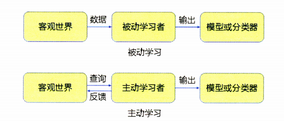

# 推荐系统相关基础知识

## 1. [特征工程](https://github.com/QinHsiu/Trick/tree/main/feature_engineer)

##### 特征的本质其实是对某个行为过程相关信息的抽象表达。推荐系统特征工程的原则：尽可能地让特征工程抽取出的一组特征能够保留推荐环境以及用户行为过程中的所有用户信息，尽量摒弃冗余信息。在已有的、可获得的数据基础上，尽量保留有用信息是一个现实的工程上的原则。

### 1.1 用户行为数据

##### 用户行为数据是推荐系统中最常用的也是最关键的数据。用户的潜在兴趣、用户对物品的真实评价均包含在用户的历史行为数据中。用户行为在推荐系统中一般分为显性反馈行为和隐性反馈行为两种，在不同的业务场景中，则以不同的形式体现。对用户行为数据的使用往往涉及对业务的理解，不同的行为在抽取特征时的权重不同，而且一些跟业务特点强相关的用户行为需要推荐工程师通过自己的观察发现。

### 1.2 用户关系数据

##### 互联网本质是人与人，人与信息之间的连接。如果用户行为数据是人与物的连接，那么用户关系数据就是人与人的连接。用户关系数据主要分为“强关系”和“弱关系”两种。“加好友、关注”等属于建立“强关系”，“处于同一个社区、看同一部电影”建立“弱关系”，可以用于建立关系图，也可以直接用于社会化推荐系统。

### 1.3 属性、标签类数据

##### 用户属性、物品属性、标签数据是最重要的描述性特征。在推荐系统中使用属性、标签类数据，一般是通过multi-hot编码的方式将其转换为特征向量，一些重要的属性标签类特征也可以转换成Embedding，再输入推荐模型。

### 1.4 内容类数据

##### 内容类型的数据可以看作属性数据的延申，它们同样是描述物品或用户的数据，但相比标签类特征，内容数据往往是大段的描述性文字、图片，甚至视频。这类数据往往需要用到自然语言处理、计算机视觉等技术手段提取相关特征，再用于推荐系统。

### 1.5 上下文信息

##### 上下文信息是描述推荐行为产生的场景的信息。最常用的上下文信息是“时间”和“地点”，后面还有“天气”等。引入上下文信息的目的是尽可能地保存推荐行为发生场景的信息，例如用户喜欢在下雪天看轻松浪漫的剧，在夜晚喜欢看恐怖的剧等。

### 1.6 统计类特征

##### 统计类特征是指通过统计方法计算出的特征，例如历史CTR，历史CVR，物品热门程度等。统计类特征一般是连续性特征，仅需要经过标准化归一化等处理就可以直接输入推荐系统进行训练。

### 1.7 组合类特征

##### 组合类特征是指将不同特征进行组合后生成的新特征向量，例如年龄加性别组成的分段特征，组合特征不一定需要手工生成，可以通过深度学习模型进行自动生成。

## 2. 常用特征处理方法

### 2.1 连续型特征

##### 对于连续性特征，常常采用归一化、离散化、加入非线性激活函数等方法进行处理。归一化的主要目的是统一各类特征的量纲（例如年龄特征最多是三位数级别，但是消费产品价格可能几万，两个不在一个数量级上），将连续特征归一化到[0,1]区间。也可以做0均值归一化，即将原始数据归一化均值为0，方差为1的数据集；离散化是通过确定分位数的形式将原来的连续性数值进行分桶，最终形成离散值的过程，离散化的主要目的是防止连续值带来的过拟合现象以及特征值分布不均匀的情况，经过离散化处理的连续性特征和经过独热编码处理的类别特征一样，都是以特征向量的形式输入推荐模型中；加入非线性函数的处理方式，是直接将原来的特征通过非线性函数做变换，然后把原来的特征以及变换后的特征一起加入模型进行训练的过程，常用的例如对数、指数等操作。

### 2.2 类别型特征

##### 类别型特征的典型例子是用户的历史行为数据、属性标签类数据等。对于该类数据常常采用独热编码或者多热编码（将一个类别向量转换为n维度的含有多个1的向量，其中n表示所有的类别数目）的方式进行处理，直接对类别型特征进行编码会导致特征向量维度过大，特征过于稀疏，容易导致模型欠拟合，模型的权重参数数量过多，导致模型收敛过慢。

## 3. 推荐系统召回与排序策略

##### 推荐系统往往先通过召回层将原始的海量数据缩小到可控范围内，然后使用排序技术（粗排和精排）从所有召回物品中选出一部分推荐给用户，其策略如下所示：

##### 召回层：特点是待计算的候选集较大、速度要快、规模简单、特征较少，尽量让用户感兴趣的物品在这个阶段能够被快速召回，即保证相关物品的召回率。

##### 排序层：首要目标是做到精准排序结果，需要处理的物品数量少，可以利用较多特征，使用比较复杂的模型。

### 3.1 使用多路召回技术

##### 所谓”多路召回策略“，就是指采用不同的策略、特征或简单模型，分别召回一部分候选集，然后把候选集混合在一起供后续排序模型使用的策略，常见的多路召回模型如下图所示：

### 3.2 基于Embedding的召回技术

##### Embedding召回的一个优势是其可以使用多路召回的思想（将其他附加信息融进Embedding中），另外其评分具有连续性。多路召回中不同召回策略产生的相似度、热度等分值不具备可比性，无法依据此决定每个召回策略放进候选集的大小，而Embedding只考虑了计算Embedding之间的相似度，因此可以随意限定召回的候选集的大小，另外Embedding的生成方法也是多种多样（MF、FM、Item2vec等方法）。

## 4. 推荐系统的实时性

##### 当模型更新的间隔时间越长的时候，其推荐效果越差；其更新得越频繁，其实时性越好，效果就越好；另外用户也希望能够快速找到自己寻找得东西，只要推荐系统能够感知用户反馈，实时地满足用户的期望目标，就能够提高推荐的效果。推荐系统的实时的重要性：

- （1）推荐系统的更新速度越快，代表用户最近习惯和爱好的特征更新越快，越能为用户进行更加有时效性的推荐；
- （2）推荐系统更新得越快，模型越容易发现最新流行得数据模式，越能让模型快速抓住最新得流行趋势；

### 4.1 推荐系统”特征“的实时性

##### 如果推荐系统不具备”特征“实时性，可能会错过增加用户黏性和留存度的机会（例如用户在某一时刻浏览了一台电脑，这个时候如果没有捕捉这一信息，就不会为用户推荐相关的产品）。推荐系统的数据流架构图如下所示：

#### 4.1.1 客户端实时特征

##### 客户端是用户最常使用的工具，也是最接近用户的环节，其能够实时收集用户会话内行为以及所有上下文特征的地方。在经典推荐系统中。可以通过http请求将这些客户端的特征上传到服务器端，但其容易忽略一点，就是客户端还是能够实现实时收集会话内用户行为的地方。传统的流计算平台（Flink），或者批处理平台（Spark）因为有延迟的存在，系统可能无法在较短时间内就把会话内用户行为存储到特征数据库中；如果客户端能够缓存会话内的用户行为，将其作为上下文特征同样的实时特征传递给服务器，那么推荐模型就能够实时地对用户进行推荐。

#### 4.1.2 流计算平台

##### 流计算平台就是指将日志文件以流的形式进行微批处理。由于每次需要等待并处理一小批日志，流计算平台并非完全实时的平台，但是其优势在于能够进行一些简单的统计类特征的计算。

#### 4.1.3 分布式处理平台

##### 随着数据逐渐使用HDFS为主的分布式系统进行存储，Spark等分布式处理计算平台终于能够进行全量特征的计算和抽取。这个阶段着重进行的还有多个数据源的数据联结以及延信号的合并。分布式处理平台的计算结构主要用途：

- （1）模型训练和离线评估；
- （2）特征保存如特征数据库，供之后线上的推荐模型使用；

### 4.2 推荐系统”模型“的实时性

##### 推荐系统”模型“的实时性往往是从更全局的角度考虑问题。推荐模型的实时性是希望更快地抓住全局层面的新数据模式，挖掘新的趋势和相关性。模型的实时性的训练方式按照由弱到强主要有以下三种：全量更新、增量更新、在线学习：

- 全量更新模式是指模型利用某段时间内的所有训练样本进行训练。该方法是最常用的训练方式，但其需要等待所有训练数据集都准备好之后才能进行训练，并且训练全部样本的时间比较长，因此其实时性效果最差；
- 增量更新是指仅仅将新加入的样本用于模型的增量训练（类似于微调，数据微调），其优点是快，其缺点是增量更新的模型往往无法找到全局最优点，因此在现实生活中往往采用全量更新与增量更新相结合的方式进行训练；
- 在线学习是实时更新的主要方法，其在获得一个新的样本的同时更新模型，其需要在线学习的环境进行模型的训练和相关参数的更新和存储，工程上的要求相对较高，另外其存在一个问题，就是模型的稀疏性不强，在线学习的另外一个方向是将强化学习与推荐系统进行结合；
- 局部更新的大致思路是降低训练效率低的部分的更新频率，提高训练效率高的部分的更新频率，其代表的方法是GDBT+LR；
- 客户端模型实时更新（联邦推荐）还处于探索阶段，比较简单的解释就是将原先传递用户数据到服务器转换为在本地完成Embedding更新，然后上传更新后的Embedding表示到服务器，由服务器根据Embedding完成后续的推荐并发送到客户端；

## 5. 推荐系统的优化目标

##### 如果一项技术本身是新颖的、先进的，但是应用的方向与实际需求方向有偏差，那这项技术的成果不可能是显著的。设定一个”合理“的推荐系统优化目标，首先需要确立一个”合理“的原则。YouTube使用用户观看时长作为优化目标，其主要商业模式是免费视频带来的广告收入，其广告收入与用户观看时长是成正比的，因此引入该指标是合理的，其模型架构如下图所示：

 

### 5.1 模型优化和应用场景的统一性

##### 优化目标的制定需要考虑模型优化场景与应用场景的统一性，实际应用场景中，用户看到的商品是一个较大的集合，其点击的只是其中一部分，点击并且购买的是更小的一部分，可以用下图进行表示：

- 针对第一部分（曝光到点击部分）可以使用点击率预估CTR模型进行推荐；
- 针对第二部分（点击并且购买）可以使用点击转化率CVR进行推荐，针对不同的应用场景使用不同的优化目标；
- 在两者同时存在的情况下，可以使用多目标优化模型进行优化，阿里提出的ESMM可以看作是结合了两者的一个模型。其底层的Embedding是CVR和CTR部分共享的，共享Embedding的目的主要是解决CVR任务样本稀疏的问题，利用CTR的数据生成更准确的用户和物品的特征表示。其中间层是CVR与CTR部分，两者各自利用完全独立的神经网络拟合自己的优化目标，最终两者相乘得到最终的优化目标，其中三者的关系为：

$$
p(y=1,z=1|x)=p(y=1|x)\times p(z=1|y=1,x)
$$

##### 其中p(y=1|x)表示点击率，p(z=1|y=1,x)表示点击转换率，其模型结构如下图所示：

##### ESMM使用多目标优化同时解决了训练空间和预测空间不一致以及利用点击率和转化率进行全局优化两个关键问题，因此根据应用场景设置自己的优化目标是推荐系统设计时候的首先需要遵循的原则。推荐系统中重要的东西：理解自己的应用场景，不要照搬照套，因为不同模型的应用场景不一样。在构建推荐模型的过程中，从应用场景出发，基于用户行为和数据的特点，提出合理的改进模型的动机才是最重要的。

## 6. 冷启动的解决办法

##### 冷启动问题是推荐系统必须面对的问题，任何推荐系统的数据都是从无到有的，在这个过程中存在数据缺乏的情况，如何在该情况下进行有效地推荐就是“冷启动问题”。常见的数据匮乏的情况有以下三种：

- （1）用户冷启动，新用户注册之后，没有任何历史行为的个性化推荐；
- （2）物品冷启动，系统加入新的物品之后，该物品没有被任何一个用户见过，如何将该物品推荐给用户；
- （3）系统冷启动，在推荐系统运行之初，缺乏所有相关历史数据时的推荐；

##### 主流的冷启动策略可以分为以下三类：

- （1）基于规则的冷启动过程；
- （2）丰富冷启动过程中获得的用户和物品的特征；
- （3）利用主动学习、迁移学习（元学习、预训练、知识蒸馏等）和“探索与利用”机制；

### 6.1 基于规则的冷启动过程

- 在没有有效的数据应用于模型的训练时，可以利用最传统的推荐方法（流行度推荐、最新趋势、高分）等统计数据进行推荐；
- 更进一步，可以参考专家意见来设置一些个性化推荐列表，根据用户有限的信息（注册时候填写的信息以及IP等）做粗粒度的规则推荐（构建人物画像等）；
- 在物品冷启动场景下，可以根据一些规则找到该物品的相似物品，利用相似的逻辑（两个相似的物品比较容易被同一个人同时喜欢，ItemCF）完成物品的冷启动，还可以使用聚类进行冷启动（根据物品的价格、属性等做聚类）

### 6.2 丰富冷启动过程中可以获得的用户和物品特征

- 使用基于规则的冷启动推荐一般情况是有效的，但是其将冷启动部分于与主模型分开来是其一个缺点。这里可以使用丰富冷启动用户和物品的信息来进行有效的推荐；
- 对于用户，可以通过设置多类注册问题（用于更细粒度地构建用户画像），以及根据其注册IP推理出其地域信息；
- 使用第三方提供的数据信息（例如推荐用户商品的时候，可以使用其观看视频的信息作为补充）；
- 物品的内容特征，在推荐系统中引入物品的内容相关特征是有效地解决“物品冷启动”的方法；
- 引入用户输入的冷启动特征（例如用户喜欢哪一类的物品等，简单来说就是标签）；

### 6.3 利用主动学习、迁移学习和“探索与利用”机制

#### 6.3.1 主动学习

##### 主动学习是相比被动学习而言的，被动学习是在已有的数据集上建模，学习过程中对不同数据集进行更改，也不会加入新的数据，学习的过程是被动的。主动学习不仅仅利用已有的数据集进行建模，而且可以主动发掘那些数据是最急需的，主动向外界发出询问，获得反馈，从而加速整个学习过程，生成更加全面的模型，两者的比较如下图所示：

##### 主动学习的原理与强化学习一脉相承，其过程完全遵循“行动-》反馈-》状态更新”的强化学习循环。

#### 6.3.2 迁移学习

##### 迁移学习是在某些领域知识不足的情况之下，迁移其他领域的数据或者知识，用于本领域的学习。直接使用两个不同领域的模型进行迁移学习需要注意的是要求这两个领域所用的特征必须保持基本一致。其包括但不限于元学习（参数迁移等）、知识蒸馏（在线蒸馏、离线蒸馏、自蒸馏）、大规模预训练模型（知识迁移）等。

#### 6.3.3 “探索与利用”机制

##### 探索与利用简单来说就是探索新数据和利用旧数据的结合。最经典的探索与利用的案例是使用UCB（置信区间上界）。其公式如下所示：

$$
UCB(j)=\overline{x_{j}}+\sqrt{\frac{2\ln n}{n_{j}}}
$$

$$
j表示第j个物品,x_{j}表示观测到的第j个物品的平均回报(CVR、CTR等),
$$

$$
n_{j}表示目前为止向用户曝光物品j的次数,n为目前为止曝光物品的总和
$$

##### 通过简单计算可以获知，当物品的平均汇报较高的时候，其UCB的得分会高；当物品曝光次数低的时候UCB的得分也会高。也就是说，使用UCB方法进行推荐，推荐系统会倾向于推荐“效果好”或者“冷启动”的物品

##### 推荐用户喜欢的内容和探索用户的新兴趣这两件事情对于推荐来说都至关重要，但是如何权衡这两件事情，就是探索与利用需要解决的问题。现在已有的方法主要包括以下三类：

- （1）传统的探索与利用方法，这类方法主要将问题简化为多臂老虎机问题，主要有贪婪、汤普森采样和UCB。该类方法着重解决新物品的探索与利用，并不考虑用户、上下文等因素，因此是非个性化的探索与利用方法；
- （2）个性化的探索与利用方法，该类方法结合了个性化推荐特点和探索与利用的思想，在考虑用户、上下文的基础上进行探索与利用的权衡，因此被称为个性化探索与利用方法；
- （3）基于模型的探索与利用方法，该类方法将探索与利用的思想融入到推荐模型之中，将深度学习模型和探索与利用的思想进行有效的结合；

##### 传统的探索与利用方法：传统的探索与利用方法主要解决一个多臂老虎机的问题（一个人面前有多台老虎机，每一台的收益情况不一样，如何在有限次数内获得最大的收益）。在推荐系统中，每一个候选商品就是一台老虎机，系统向用户推荐物品就相当于选择老虎机的过程。如果不考虑个性化的问题，就是一个脱离用户的，只是针对老虎机的优化问题，解决传统老虎机问题的主要算法有贪婪、汤普森采样和UCB。

- （1）贪婪算法的主要流程是，选一个[0,1]之间的数epsilon，每次以epsilon的概率在所有老虎机中进行随机采样，以(1-epsilon)的概率选择截止当前平均收益最大的老虎机，在摇臂后，根据汇报值对老虎机的回报期望进行更新，这里的epsilon是对“探索”的偏好程度，每次以该概率去探索，以1-epsilon的概率来利用，基于被选择的物品的回报更新该物品的回报期望。该算法是非常简单实用的探索与利用算法，但是其对探索部分和利用部分的划分还略显粗暴和生硬；
- （2）汤普森采样算法是一种经典的启发式探索与利用算法。该算法假设每个老虎机都能够赚钱的概率是p，同时概率p的分布符合beta（要么win，要么loss）分布，每个老虎机都维护一组beta分布的参数，每次实验之后选中一个老虎机，摇臂之后有收益则该老虎机win值加一，否则该老虎机loss值加一。每次选择老虎机的方式是，利用老虎机现有的beta分布产生一个随机数b，逐一生成每一个老虎机的随机数，选择随机数中最大的那个老虎机进行尝试。这里的beta分布是伯努利分布的共轭先验分布，因为掷硬币的过程是标准的伯努利过程，如果为硬币正面的概率指定一个先验分布，那么这个分布就是beta分布。该算法适用于CTR预估场景；
- （3）UCB算法也利用了分布的不确定性作为探索强势程度的依据。其算法流程如下：
  - a.假设有K个老虎机，对每一个老虎机进行摇臂m次，获得老虎机j的收益的初始化经验期望；
  - b.使用t表示至今摇臂的总次数，用nj表示第j个老虎机至今被摇臂的次数，计算每一个老虎机的UCB值（通过上面的公式进行计算）；
  - c.选择UCB值最大的老虎机i摇臂，并观察其收益x(i,t )；
  - d.根据收益更新老虎机i的收益期望值；
  - e.重复第二步骤。UCB算法的重点是UCB值的计算方法，其中平均期望指的是老虎机j之前实验的收益期望（可以看作是“利用”的分值）；
  - 另外一部分就是所谓的置信区间宽度（代表了“探索”的分值），两者相加就是老虎机j的置信区间的上限；

##### 个性化的探索与利用方法：引入个性化信息是很有必要的，这类方法通常称之为基于上下文的多臂老虎机算法，其中最具代表性的是LinUCB算法。其中Lin是Linear的意思，因为该方法是建立在个性化推荐模型或者CTR预估模型之上的，线性模型的数学表达式如下所示：

$$
E{r_{t,a}|x_{t,a}}=x^{T}_{t,a}\theta^{*}_{a}
$$

$$
其中x_{t,a}表示老虎机a在t次实验中的特征向量,\theta^{*}_{a}代表模型参数,r_{t,a}表示摇动老虎机a获得的回报期望
$$

##### 为了获得每个老虎机的模型参数，可以采用岭回归的训练方式，其表达式如下所示：

$$
\hat{\theta_{a}}=(D^{T}_{a}D_{a}+I_{d})^{-1}D^{T}_{a}c_{a}
$$

$$
其中I_{d}是dxd维度的单位向量,d是指老虎机a特征向量的维度,D是一个mxd维的样本矩阵
$$

$$
m是指训练样本中与老虎机a相关的m个训练样本,所以矩阵D的每一行就是一个与老虎机a相关样本的特征矩阵
$$

$$
向量c_{a}是所有样本的标签组成的向量,其顺序与D的样本顺序一致
$$

##### 其探索部分得分可以使用下式进行表示

$$
\alpha\sqrt{x^{T}_{t,a}A^{-1}_{a}x_{t,a}}
$$

$$
A_{a}=D^{T}_{a}D_{a}+I_{d}
$$

##### 其探索部分得分本质上是对预测不确定性的一种估计，预测的不确定性越高，抽样得出高分的可能性越大，所以其探索部分的得分也是对线性模型预测不确定性的估计。该方法的提出大大增强了模型预测的准确度与精度和探索的针对性

 ##### 基于模型的探索与利用方法：前面所述的两种方法都无法与深度模型进行有效地结合。可以通过对模型参数加入一些扰动，使得模型能够对不同的内容进行探索

##### 探索与利用机制在推荐系统中的应用主要包括以下三个方面：（1）物品冷启动，对于新加入的物品或者长久没有互动的长尾物品来说，使用探索与利用机制可以在较少损害系统整体收益的情况之下快速找到有潜力的物品，丰富优质的物品候选集；（2）发掘用户的新兴趣，用户的兴趣是不断变化的，需要通过探索不断抓住用户兴趣改变的趋势；（3）增加结果多样性，增加结果多样性对于推荐系统的好处主要在于两方面，一方面是让用户能够明显感觉到结果的丰富性，另外一方面是减少大量同质化内容的同时出现时用户的厌倦情绪

#### Tips:

#### 1. UCB公式的由来

##### UCB的公式来源于霍夫丁不等式，假设有N个范围在[0,1]之间的独立有界随机变量，这N个随机变量的经验期望为：

$$
\overline{X}=\frac{X_{1}+X_{2}
+...+X_{n}}{n}
$$

##### 该期望满足霍夫丁不等式：

$$
p(\overline{X}-E[\overline{X}]\geq \epsilon)\leq e^{-2n{\epsilon}^{2}}
$$

##### 现在可以有：

$$
令\epsilon=\sqrt{\frac{2\log t}{n
_{j}}},有 p(\overline{X}-E[\overline{X}]\geq \sqrt{\frac{2\log t}{n
_{j}}})\leq t^{-4}
$$

##### 如果UCB的上界为epsilon，那么X的均值与X的实际期望的差距在上界之外的概率非常小，小于t的-4次方，这就说明采用UCB的上界形式是严格合理的

#### 2. 如何缓解冷启动带来的影响

##### 如何缓解数据冷启动的问题，主要有两个解决思路：（1）可以最大限度利用一些粗粒度的特征、属性，甚至其他领域的知识进行冷启动推荐；（2）可以先利用规则推荐方法进行冷启动推荐，然后将得到的反馈用于主要模型的训练和更新，边进行冷启动，边进行模型的更新

