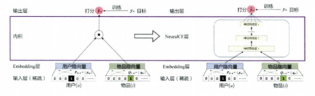

# 深度学习推荐模型

## 1.演进脉络

### a.改变神经网络的复杂程度：从简单的AutoRec到经典的深度神经网络结构（不断增加模型复杂度与结构复杂度）

### b.改变特征交叉方式，对特征向量使用不同的方式进行组合，进入到Deep Crossing

### c.组合模型，组合不同模型的优点，实现模型的优势互补，例如Wide&Deep，Deep&Cross，DeepFM等

### d.FM模型的深度演化版本，例如NFM（神经网络因子分解机），FNN（基于因子分解机支持的神经网络），AFM（注意力因子分解机）等

### e.注意力机制与推荐模型的结合，主要有AFM和用于CTR预估的DIN（深度兴趣网络）

### f.序列模型与推荐模型的结合，使用序列模型模拟用户兴趣的演化趋势，主要有DIEN（深度兴趣进化网络）

## 2.相关模型简介

### 2.1 AutoRec

#### 该方法将自编码器的思想与协同过滤相结合，提出了一种单隐藏层神经网络推荐模型。其原理是依据用户与商品的共现矩阵（输入），完成用户向量与物品向量的自编码（输出）。然后利用自编码的结果得到用户的预估评分，进而进行排序。模型架构如下图所示：

#### Tips：自编码器

##### 自编码器是能够完成数据“自编码”的模型，假设其数据向量为r，自编码器的作用是将向量r作为输入，通过自编码器后得到的输出向量尽量接近与原始输入的数据，度量公式如下：

$$
\min\limits_{\theta}\sum\limits_{r\in S}||r-h(r;\theta)||_{2}^{2}
$$

##### 其中h(r;\theta)为编码器的输出

$$
h(r;\theta)=f(W\cdot g(Vr+\mu)+b)
$$

##### W和V表示输出层到隐藏层与隐藏层到输出层的参数矩阵，f(·)与g(·)表示激活函数，AutoRec的目标函数如下所示：

$$
\min\limits_{\theta}\sum^{n}\limits_{i=1}||r^{i}-h(r^{i};\theta)||_{2}^{2}
+\frac{\lambda}{2}\cdot(||W||_{F}^{2}+||V||_{F}^{2})
$$

##### 前向传播与反向传播：前向传播的目的是在当前网络参数的设置之下，得到模型对于输入的预估值；在得到预估值之后根据定义的损失函数，然后根据链式求导法则进行求导并进行梯度反向传播，用于更新模型参数。

#### AutoRec推荐过程：（1）输入评分矩阵（注意，评分矩阵为UxI，用户数目x商品数目，如果按照行进行输入，则是按一个用户进行预测的；如果是按照列输入，则是按一个商品的评分进行预测的）；（2）模型获得输出；（3）根据目标函数计算损失；（4）根据损失进行反向传播更新模型参数。

##### AutoRec模型的优缺点：其优点是模型结构简单，易于部署和快速训练；缺点是表达能力较差（既不能捕捉特征之间的潜在关系，也没有充分利用各个特征，导致大量的有用信息被忽略了）。后续在该基础之上又有了更多的基于自编码器的模型（DAE、SAE、VAE、CAE等等）

### 2.2 Deep Crossing模型

#### 应用场景：微软搜素引擎中Bing的搜索广告推荐场景；其主要使用了三类特征（数值型、类别型、组特征（例如一个广告计划中的预算，包括广告id，广告预算等））进行建模，如下图所示：

##### DeepCrossing利用这些特征进行CTR预估。其在网络内部中需要解决以下三个问题：（1）离散类型的特征过于稀疏，不利于直接输入神经网络进行训练，如何解决稀疏特征稠密化的问题；（2）如何解决特征自动交叉组合的问题；（3）如何在输入层中达成问题设定的优化目标。DeepCrossing针对上述问题设置了不同的神经网络来进行处理，其模型如下图所示：

##### Embedding层：该层的作用是将稀疏的类别特征转换为稠密的Embedding向量；该层的结构以经典的全连接层为主，注意Feature2为数值类型特征，因此不需要对其进行Embedding操作；

##### Stacking层：Stacking层是将不同特征编码之后的表示（或者数值型特征）进行拼接，形成一个包含了所有特征的向量表示，该层通常也叫连接层

##### Multiple Residual Units层：该层的主要结构是多层感知机，相比标准的以感知机为基本单元的神经网络，该方法采用了多层残差网络作为MLP的具体实现 

##### Scoring层：其为输出层，用于拟合优化目标而存在，对于CTR预估，该层常常使用逻辑回归模型；对于多分类问题，该层常常采用softmax模型

##### Deep Crossing模型的优缺点：其优点是考虑了特征的交叉，缺点是利用全连接层进行特征交叉，针对性不强（没有充分利用特征之间的相关信息）

#### Tips：残差网络是由残差单元组成的神经网络，其主要实现就是将输入与经过带激活函数的线性层所得输出进行相加。如下图所示，其主要包含两个特点：（1）残差单元中包含了一个以ReLu的激活函数的全连接层；（2）输入通过一个短路通路直接与全连接层输出进行元素相加。残差单元拟合的是输出与输入之间的”残差“。其核心是解决以下两个问题：（1）神经网络是不是越深越好？模型参数过可能会导致出现过拟合现象，也即网络参数越多，其在测试集上效果越差，引入残差单因为有输入向量短路的存在，很多时候可以越过两层激活函数，减少过拟合现象的发生；（2）当神经网络过深的时候存在梯度消失（在梯度反向传播过程中，越靠近输入端，梯度的幅度越小，参数的收敛速度越慢）的情况，残差单元通过引入ReLU激活函数替换原来的Sigmod函数来缓解这一问题，另外输入向量短路相当于直接把梯度毫无变化地传递给下一层，这也加快了模型的收敛速度

### 2.3 NeurCF模型

#### 矩阵分解中用户的隐向量与商品的隐向量可以看作是深度学习中的Embedding，其最终的输出层就是将用户的隐向量与商品的隐向量作内积操作之后得到”相似度“，这里”相似度“就是对评分的预测预测。在使用传统矩阵分解进行预测的时候往往会出现欠拟合的情况，主要原因是模型结构简单，无法对优化目标进行有效的拟合。为了缓解这一问题，在传统矩阵分解的框架之下引入了神经网络。该方法的优点主要有：（1）让用户向量和物品向量做更加充分的交叉，得到更多有价值的特征组合信息；（2）引入更多的非线性特征可以使得模型的表达能力变强。传统矩阵分解（左）与神经矩阵分解（右图）过程如下图所示：

##### 原始的矩阵分解使用“内积”的方式让用户和物品向量进行交互，为了进一步让向量在各个维度上进行充分交叉，可以通过“元素积”（相同长度的两个向量的对应维度相乘得到另外一个向量）的方式进行交互操作，再通过逻辑回归等输出层拟合最终预测目标。NeurCF利用神经网络拟合互操作函数的做法是广义的互操作形式。NeurCF给出了整合两个不同网络的例子，其结构如下图所示：

##### NeurCF的优势及其局限性，NeurCF提出了一种基于用户向量与物品向量进行特征交叉的模型框架，可以灵活地进行不同互操作层的拼接，深度学习具有拟合任何函数的能力，其可以按需求自由增加和减少模型复杂度；需要注意的地方有（1）模型不是越复杂效果越好（越复杂的模型容易出现过拟合现象）；（2）模型越复杂会需要更多的数据和更加长的训练时间才能够使得模型收敛。其主要的局限性有（1）因为是基于协同过滤进行的改造，因此其没有引入其他类型的特征，这实际上浪费了一些具有价值的信息；（2）对于模型中互操作的种类没有做进一步的说明，有待进一步的挖掘和探索

#### Tips：softmax函数（[更多激活函数](https://github.com/QinHsiu/Trick/tree/main/activate_function)）

##### softmax函数主要用于解决多分类问题，给定一个向量，softmax函数将其映射为一个概率分布，其公式如下所示：

$$
\sigma(X)=\frac{\exp(x_{i})}{\sum\limits_{j=1}^{n}\exp(x_{j})},i \in [1,n],X=[x_{1},...,x_{n}]^{T}\in \mathbb{R}
$$

 ##### 从上式可以看出softmax函数解决了一个从n维向量变为了一个n维的概率分布。假设分类数目是n，经过softmax之后的输出就表示每一个类别的概率值，另外在分类问题中，softmax函数往往配合交叉熵损失函数一起使用，其公式以及求导结果如下所示：

$$
Loss=-\sum\limits_{i}y_{i}\ln(\sigma(x)_{i}),y_{i}表示真是标签值,\sigma(x)_{i}表示对i个类别的预测值
$$

$$
\frac{\partial\sigma(x)_{i}}{\partial x_{i}}=\left\\{\begin{array}{**lr**} \sigma(x)_{i}(1-\sigma(x)_{j}) &,i=j\\\\-\sigma(x)_{i}\cdot\sigma(x)_{j}&,i\neq j \end{array}\right.
$$

$$
\frac{\partial Loss}{\partial x_{j}}=\frac{\partial Loss}{\partial\sigma(x)}\cdot\frac{\partial\sigma(x)}{\partial x_{j}}
$$

##### 在多分类中，如果采用hard label进行类别判断，则只有一个维度为1，其他类别维度都为0，假设k维度为1，其他维度都为0，则交叉熵函数及其导数可以简写为：

$$
Loss=-\sum\limits_{i}y_{i}\ln(\sigma(x)_{i})=-y_{k}\cdot\ln(\sigma(x)_{k})=-\ln(\sigma(x)_{k})
$$

$$
\frac{\partial Loss}{\partial x_{j}}=\frac{\partial(-\ln(\sigma(x)_{k}))}{\partial\sigma(x)_{k}}\cdot\frac{\partial\sigma(x)_{k}}{\partial x_{j}}=-\frac{1}{\sigma(x)_{k}}\cdot\frac{\partial\sigma(x)_{k}}{\partial x_{j}}=\left\\{\begin{array}{**lr**}\sigma(x)_{j}-1&,j=k\\\sigma(x)_{j}&,j\neq k\end{array}\right.
$$

### 2.4 PNN模型

##### PNN模型提出是为了解决CTR预估和推荐系统的问题，其模型结构与Deep Crossing有很多相似的地方，主要区别在于PNN模型用乘积层代替了Deep Crossing中的Stacking 层，具体说就是将原先的简单的拼接操作，换成了使用乘积操作进行两两交互，模型如下图所示：

#####  相比与NeurCF，其在输入层新加入了一些不同的特征，另外其给出了更多的特征交互操作方式。其对于深度学习结构的主要创新在于引入了乘积层的。其乘积层主要由线性操作部分和乘积操作部分组成。其中乘积操作部分又分为内积操作和外积操作，使用内积操作的模型又称之为IPNN，使用外积操作的PNN模型又叫OPNN。其操作的对象都是两个不同的特征，为了保证乘积操作的顺利进行，两个特征的维度必须相同，内积操作与外积操作公式如下：

$$
\left\\{\begin{array}{**lr**}g_{inner}(f_{i},f_{j})=(f_{i},f_{j})\\\\g_{outer}(f_{i},f_{j})=f_{i}f^{T}_{j}\end{array}\right.
$$

##### 其中外积操作生成的是一个方形矩阵。这里外积的操作会将复杂度从原来的M上升到M方，为了进一步减少模型训练的负担，PNN模型介绍了一种降维的方法，就是将所有外积操作的结果进行叠加，形成一个叠加矩阵p。其中p最终形式类似于让所有特征向量通过一个平均池化层（注意平均池化往往适用于同类的特征，如果将不同种类的特征进行池化操作会模糊很多有用的信息），再进行外积互操作。具体公式如下所示：

$$
p=\sum^{N}\limits_{i=1}\sum^{N}\limits_{j=1}g_{outer}(f_{i},f_{j})=\sum^{N}\limits_{i=1}\sum^{N}\limits_{j=1}f_{i}f^{T}_{j}=f_{\Sigma}f_{\Sigma}^{T},f_{\Sigma}=\sum^{N}\limits_{i=1}f_{i}
$$

##### PNN模型的优势与局限性：PNN的结构特点在于其强调了特征Embedding之间的交互方式是多样的，另外其使用的乘积操作为特征交互提供更多的可能；其局限性有（1）外积操作在实际应用中，为了优化训练加入了大量的简化操作；（2）对所有特征进行无差别的交叉，一定程度上忽略了原始特征向量中包含的有价值的信息

### 2.5 Wide&Deep模型

##### 其主要思路在于使用单层的Wide与多层Deep部分组成混合模型。Wide部分作用是使得模型具有较强的“记忆能力”，Deep部分主要作用是让模型具有更好的“泛化能力”，这种混合的方法使得模型具有了逻辑回归和深度神经网络的优点（能够快速处理并记忆大量历史行为特征，并且具有强大的表达能力）。该模型把但输入层的Wide部分与有Embedding层和多隐藏层组成的Deep部分连接起来，一起输入最终的输出层。单层的Wide部分善于处理大量的稀疏id特征；Deep部分利用神经网络具有表达能力强的特点，进行深层次的挖掘藏在特征背后的数据模式；最后利用逻辑回归模型，输出层将Wide与Deep部分组合起来，形成统一的模型。其简版模型与具体模型如下图所示：

##### 从上图可以看出，Deep部分的输入为所有的特征（其中类别型特征进行了Embedding处理），然后是经过连接层进行拼接，接着进入三层ReLU全连接层，最终输入LogLoss输出层；Wide部分的输入仅仅只有两种特征，选择该两类特征的原因是为了充分发挥Wide部分的记忆能力强的优势，简单模型善于记忆用户行为特征中的信息，并根据此类信息直接影响推荐结果

##### Wide部分组合两个特征的函数被称为“交叉积变换”函数，其形式定义如下：

$$
\Theta_{k}(x)=\prod\limits_{i=1}^{d}x^{c_{ki}}_{i},c_{ki}\in\{0,1\},c_{ki}表示第i个特征是否属于第k个组合（是为1，否则为0）
$$

##### 在经过交叉及变换操作之后，Wide部分将组合特征输入最终的LogLoss输出层，与Deep部分一起参与最后的目标拟合，完成与Deep的融合

##### Wide&Deep模型的影响力：在一定程度上，可以将DeepFM、NFM看作是Wide&Deep的延伸，其取得成功的关键在于两点（1）抓住了业务问题的本质特点，能够融合传统模型记忆能力和深度学习模型泛化能力的优势；（2）模型结构不复杂，比较易于在工程上进行实现、训练和上线，加速其在工业界的推广与应用。其局限性在于Wide部分需要人工进行特征组合的筛选

#### Deep&Cross模型（DCN）

##### DCN模型使用Cross网络替换原来的Wide部分，Deep部分基本没有改变。设计Cross网络的目的是增加特征之间的交互力度，使用多层交叉层对输入向量进行特征交叉。其结构如下图所示：

$$
x_{l+1}=x_{0}x^{T}_{l}W_{l}+b_{l}+x_{l},其中x_{l}表示第l层交叉层的输出向量,w_{l}表示权重向量,b_{l}表示偏执向量
$$

##### 从上式可以看出，交叉层的二阶部分非常类似于PNN模型中的外积操作，其在此基础上引入了一个权重向量和偏执向量。其交叉操作如下图所示：

##### 从上图可以获知，交叉层每一层只是增加了一个线性层，并且在每一层均保留了输入向量，因此输入与输出之间的变化不明显。由多层交叉层组成的Cross网络在Wide&Deep中Wide部分的基础上进行特征自动交叉，避免了更多人为的操作。Deep&Cross中Deep部分较于Cross部分表达能力更强，使得模型具有更强的泛化能力

##### Deep&Cross模型的优缺点：其优点是改进了Wide&Deep中的Wide部分需要人工进行特征组合的问题；其局限性在于Cross网络的复杂度较高

#### Tips：记忆能力与泛化能力

##### 记忆能力可以理解为模型直接学习并利用历史数据中特征的“共现频率”的能力。例如协同过滤与逻辑回归具有较强的“记忆能力”，给定一组数据，其能够根据历史行为模式直接给出推荐结果，这就相当于模型直接记住了历史数据的分布特点，并利用这些特点进行推荐。而对于深度神经网络模型，特征会被多层处理，不断与其他特征进行交叉，因此模型对于简单的强特征（共现频率）反而没有简单模型深刻

##### 泛化能力可以被理解为模型传递特征的相关性，以及发掘稀疏甚至从未出现过的稀有特征与最终标签相关的能力。矩阵分解比较与协同过滤的泛化能力更强，因为矩阵分解引入了隐向量这样的机制，使得数据稀少的用户或者物品也能够生成隐向量，从而获得有数据支撑的推荐得分。另外深度神经网络通过特征的多次自动组合，可以深度发掘数据中潜在的模式，即使非常稀疏的特征向量输入，也能够得到较平稳（平滑稳定）的推荐概率

### 2.6 FM与深度学习模型的结合

##### FNN模型结构与Deep Crossing类似，从稀疏向量到稠密向量的转换过程也是经典的Embedding层结构，其关键在于Embedding层的改进。在神经网络的参数初始化过程中往往采用随机初始化这种不包含任何先验知识初始化方法。但由于Embedding极端稀疏化的原因，其收敛速度非常缓慢，另外Embedding参数占据模型参数的一大半，因此模型的收敛速度往往受限于Embedding层。其模型结构如下图所示：

##### 针对Embedding层收敛速度的难题，FNN模型采用FM模型训练好的各特征隐向量初始化Embedding层的参数，相当于在初始化神经网络参数时已经引入了有价值的先验知识。这导致神经网络训练的起点更接近于最优点，自热加速了整个神经网络的收敛速度。上图中虽然FM中的参数直接指向了Embedding层的各神经元，但是其含义是初始化Embedding神经元与输入神经元之间的连接权重。另外在训练FM的过程中，并没有对特征域进行区分，但在FNN模型中，特征被分成了不同特征域，因此每个特征域具有对应的Embedding层，并且每个特征域Embedding的维度都应该与FM的隐向量维度保持一致。另外FNN模型使用FM进行参数初始化（其为Embedding与训练提供了借鉴思路）。其局限性在于模型的主要结构比较简单，没有针对性的特征交叉层

#### Tips：Embedding收敛速度慢

##### 深度学习中Embedding层的作用是将稀疏输入向量转换为稠密向量，但是Embedding层的存在往往会拖慢整个模型的收敛速度，其原因主要有（1）Embedding层的参数量巨大，大部分的训练时间都被Embedding所占据；（2）由于输入向量过于稀疏，在随机梯度下降过程中，只有与非零特征相连的Embedding层的权重会被更新，这进一步降低了Embedding收敛的速度

#### 2.6.1 DeepFM

##### FNN把FM的训练结果作为初始化权重，并没有对神经网络的结构进行改动。该模型则将FM与Wide&Deep进行了整合，其模型结构如下图所示：

##### DeepFm对于Wide&Deep的改进在于其使用FM替换了原来的Wide部分，加强了浅层神经网络部分特征组合的能力。从上图可以看出，其左边的FM部分与右边的深度神经网络部分共享相同的Embedding层。左侧的FM部分对不同的特征域的Embedding进行了两两交叉，也就是将Embedding向量作为原始FM中的隐向量。最后将FM的输出与Deep部分的输出一同输入最后的输出层，参与最后的目标拟合。其针对Wide&Deep的改进主要在于Wide部分不具备自动的特征组合能力，这里改进动机与Deep&Cross模型的完全一致，唯一的不同在于Deep&Cross模型利用多层Cross网络继续宁特征组合，而DeepFM使用FM进行特征组合。其局限性在于其模型结构与Wide&Deep的结构差异不明显

#### 2.6.2 NFM

##### FM、FFM都是一个二阶特征交叉的模型，都受限于特征组合爆炸，FM几乎不可能扩展到三阶以及以上，这就不可避免地限制了FM模型的表达能力。NFM主要思路是使用一个表达能力更强的函数替代原FM中二阶隐向量内积的部分，两者的公式比较如下所示：

$$
\hat{y}_{FM}(x)=w_{0}+\sum^{N}\limits_{i=1}\sum^{N}\limits_{j=i+1}v_{i}^{T}v_{j}\cdot x_{i}x_{j}\\ \hat{y}_{NFM}(x)=w_{0}+\sum^{N}\limits_{l=1}w_{l}x_{l}+f(x)
$$

##### 其中f(x)是使用深度学习网络来进行拟合的一个函数，其使用反向传播来进行学习，NFM中使用的神经网络结构如下图所示：

##### 如上图所示，NFM的网络架构的特点非常明显，其在Embedding层和多层神经网络之间加入特征交叉池化层，其池化操作可以用以下表达式进行表示：

$$
f_{BI}(V_{x})=\sum^{N}\limits_{i=1}\sum^{N}\limits_{j=i+1}(x_{i}v_{i})\bigodot(x_{j}v_{j})
$$
$$
\bigodot表示元素积操作,V_{x}表示所有特征域的Embedding的集合\\\\(v_{i}\bigodot v_{j})_{k}=v_{ik}v_{jk},其中对于k维度的元素积操作如左所示
$$

##### 在进行两两Embedding向量的元素积操作后，对交叉特征向量取和，得到池化层的输出向量。然后将该向量输入上层的多层全连接层神经网络进行进一步特征交叉。如果把NFM的一阶部分视为一个线性模型，那么NFM的架构也可以视为Wide&Deep模型的进化。其相比与FM具有更强的表达能力和特征交叉能力，但是其模型架构与PNN特别相似

##### 基于FM的深度学习模型的优点与局限性：（1）在经典多层神经网络的基础上加入有针对性的特征交叉操作，使得模型具备更强的非线性表达能力；（2）从PNN到NFM等模型，进行了大量的特征交叉操作思路的尝试。但是模型进一步提升的空间非常小

### 2.7 注意力机制的应用

#### 2.7.1 AFM

##### AFM在NFM的基础之上进行了改进，在NFM中的特征交叉池化层中，所有特征只是简单地进行加和运算，这忽略了特征对于模型效果的影响程度是不一样的，这样会消解了大量有用的信息。基于注意力机制的假设开始排上用场，这会导致模型学习到特征的不同重要程度。AFM模型引入注意力机制是通过特征交叉层和最终的输出层之间加入注意力网络（注意力网络的作用是为每一个交叉特征提供权重，也就是注意力得分）实现的，其模型结构如下图所示：

##### 同NFM一样，AFM的特征交叉过程同样采用了元素积操作，其元素积操作和池化操作如下所示：

$$
f_{PI}(\epsilon)={(v_{i}\bigodot v_{j})x_{i}x_{j}}_{(i,j)\in \mathcal{R}_{x}}\\
f_{Att}(f_{PI}(\epsilon))=\sum\limits_{(i,j)\in \mathcal{R}_{x})}a_{ij}(v_{i}\bigodot v_{j})x_{i}x_{j}
$$

##### 对于注意力得分来说，最简单的方法就是用一个权重参数进行表示，但是为了防止交叉特征数据稀疏带来的权重参数难以收敛的问题，AFM模型使用了一个在两两特征交叉层和池化层之间的注意力网络来生成注意力得分，其结构就是一个简单的单全连接层加上一个softmax输出层的结构，其公式如下所示：

$$
a^{'}_{ij}=h^{T}ReLU(W(v_{i}\bigodot v_{j})x_{i}x_{j}+b)\\
a_{ij}=\frac{\exp(a^{'}_{ij})}{\sum\limits_{(i,j)\in \mathcal{R}_{x}}\exp(a^{'}_{ij})}
$$

##### 其中要学习的模型参数就是特征交叉层到注意力网路全连接的权重矩阵W，偏置向量b，以及全连接层到softmax输出层的权重向量h。注意力网络将于整个模型一起参与梯度反向传播的学习过程，得到最终的权重参数。其优点在于考虑了不同交叉特征的重要性不同；其局限性在于注意力网络的训练过程比较复杂

#### 2.7.2 DIN

##### DIN应用场景为电商广告推荐，因此在计算一个用户u是否点击一个广告a时，模型的输入特征主要包含两部分，一部分为用户a的特征组，一部分为候选广告的特征组（广告中除了商品id，还有广告id）。如果简单地对商品序列和商铺序列进行简单的平均池化操作就放入神经网路，序列中的商品既没有区分重要程度，也和广告特征中的商品id没有关系。然而实际情况是广告特征和用户特征的关联程度非常高。其与Base模型的结构如下图所示：

##### DIN利用候选商品和历史行为商品之间的相关性计算出一个权重，这个权重就代表了“注意力”的强弱，加入注意力权重的深度学习网络就是DIN模型，其注意力表达式如下所示：

$$
V_{u}=f(V_{a})=\sum^{N}\limits_{i=1}w_{i}\cdot V_{i}=\sum^{N}\limits_{i=1}g(V_{i},V_{a})\cdot V_{i}
$$
$$
其中V_{u}表示用户的Embedding向量,V_{a}是候选广告商品的Embedding向量,V_{i}是用户u对于第i次行为的Embedding向量
$$

##### 需要注意的地方是在DIN中，商品id只是与用户历史行为的商品id进行作用，商铺id只是与用户历史商铺序列发生作用。因为注意力的轻重应该由同类信息的相关性决定。DIN的优点在于根据目标广告物品的不同，进行更加有针对性的推荐；其局限性在于并没有充分利用除却历史行为以外的其他特征（时间等）

#### 2.7.3 DIEN

##### 用户的历史行为序列其实是一个随时间排序的序列（时间相关的序列），这使得历史序列中的元素之间存在一种潜在的序列模式（前后依赖关系）。序列信息的重要性在于两点（1）加强最近行为对与下次行为预测的影响；（2）序列模型能够学习到购买趋势的信息。因此DIEN诞生了，其模型的创新点在于如何构建“兴趣化网络”（能够捕捉用户历史行为模式的网络）。其模型主要包括三层：（1）行为序列层，主要是将原始序列id转换为Embedding行为序列；（2）兴趣抽取层，主要是通过模拟用户的兴趣迁移过程，抽取用户兴趣；（3）兴趣进化层，其主要作用是通过在兴趣抽取层引入注意力机制，模拟与当前目标广告相关的兴趣进化过程。其模型如下图所示：

##### 兴趣抽取层的基本单元是GRU网络，相比传统RNN和LSTM，GRU解决了RNN的梯度消失问题和LSTM参数量大的问题，其收敛速度更快，其中GRU公式如下所示：
$$
u_{t}=\sigma(W^{u}i_{t}+U^{u}h_{t-1}+b^{u})
$$

$$
r_{t}=\sigma(W^{t}i_{t}+U^{r}h_{t-1}+b^{r})
$$

$$
\tilde{h_{t}}=\tanh(W^{h}i_{t}+r_{t}\bigodot U^{h}h_{t-1}+b^{h})
$$

$$
h_{t}=(1-u_{t})\bigodot h_{t-1}+u_{t}\bigodot\tilde{h_{t}}
$$

$$
其中\sigma为sigmoid激活函数,\bigodot为元素积操作,W与U为需要学习的参数矩阵,i_{t}为输入状态向量(各行为Embedding向量),h_{t}表示第t个隐状态向量
$$

##### 兴趣进化层引入力注意力机制。其获得注意力得分的操作与DIN一致。其目的是更有针对性地模拟与目标广告相关的兴趣演化路径。兴趣进化层完成注意力机制是通过AUGRU机构完成的，AUGRU在GRU的基础上加入了注意力得分，具体形式如下所示：

$$
\tilde{u}^{'}_{t}=a_{t}\cdot u^{'}_{t}\\
h^{'}_{t}=(1-\tilde{u}^{'}_{t})\bigodot h^{'}_{t-1}+\tilde{u}^{'}_{t}\bigodot \tilde{h}^{'}_{t}
$$

##### DIEN的优点在于其增强了系统对用户兴趣变迁的表达能力，使得推荐系统开始考虑时间相关的行为序列中包含的有价值信息；其局限性在于训练过程复杂，线上服务延迟较长，需要进行工程上的优化

### 2.8 强化学习与推荐系统的结合

##### 强化学习的研究起源于机器人领域，针对智能体在不断变化的环境中决策和学习的过程进行建模。其主要由以下几个部分构成：

##### 智能体：推荐系统本身，其包括基于深度学习的推荐模型、探索策略以及相关的数据存储；环境：由新闻网站或者App、用户组成的整个推荐系统外部环境，在环境中，用户接收推荐的结果并进行反馈；行动：对于一个新闻推荐系统来说，”行动“指的就是推荐系统进行新闻推荐排序后送给用户的动作；反馈：用户收到推荐结果之后，进行正向和负向的反馈；状态：状态是指对环境以及自身当前所处具体情况的刻画，在新闻推荐中，状态可以看成是已收到所有行动和反馈，以及用户和新闻推荐的所有相关信息的特征向量表示。

##### 强化学习中模型的迭代主要分为以下几步：（1）初始化推荐系统（智能体）；（2）推荐系统基于当前已收集的数据（状态）进行新闻排序（行动），并推送到网站或者App端；（3）用户收到推荐列表，点击或者忽略（反馈）推荐结果；（4）推荐系统收到反馈，更新当前状态或者通过模型训练更新模型；（5）重复第二步骤。其核心在于不断根据反馈进行更新

#### 2.8.1 DQN

##### Q指通过对行动进行质量评估，得到行动的效用得分，以此进行行动决策。DQN在特征工程中套用强化学习状态向量和行动向量，把用户特征和环境特征归为状态向量，因为他们与具体的行动无关，并把用户与新闻的交叉特征归为行动特征，因为其与推荐目标这一行动相关。其网络结构如下图所示：

##### 用户特征和环境特征经过左侧多层神经网络的拟合生成价值得分，利用状态向量和行动向量生成优势得分，最后把两部分得分综合起来得到最终质量得分。价值得分与优势得分都是强化学习中的概念

#### 2.8.2 DRN

##### DRN的学习过程是整个强化学习推荐系统架构的重点，正是由于可以在线更新，才使得强化学习模型相比其他静态模型有了更加实时性上的优势。其学习过程主要包括：（1）离线部分：根据历史行为数据训练好DRN模型，作为智能体的初始化模型；（2）从t1到t2过程，利用初始化模型进行一段时间的推送，并积累反馈数据；（3）在t2时间节点利用前面收集的反馈信息由于模型参数的微更新（使用竞争梯度下降算法进行在线训练）；（4）在t4阶段利用前面所有的反馈数据进行模型的主更新；（5）重复（2）~（4）步骤。其学习流程如下图所示：

##### 竞争梯度下降算法主要过程如下：（1）对于已经训练好的当前网络Q，对其模型参数W添加一个较小的随机扰动，得到新的模型参数，其对应的网路为探索网络（加扰动的操作类似与数据增强，可以增加模型的鲁棒性）；（2）对于当前网络和探索网络，分别生成推荐列表，使用Interleaving将两个推荐列表进行组合后推荐给用户；（3）实时收集用户反馈，如果探索网络生成的内容的效果好于当前网络，则使用探索网络替换当前网络，进入下一次迭代，反之则保留当前网络。其中第一步加入随机扰动可以使用下列式子进行表示：

$$
\Delta W=\alpha\cdot rand(-1,1)\cdot W,其中\alpha为探索因子,rand(-1,1)是一个随机数
$$

##### DRN的在线学习过程利用了”探索的思想“，其调整模型的粒度可以细分到每次获取反馈之后，这一点很像随机梯度下降的思路，虽然一次样本的结果可能产生随机扰动，但只要总的下降趋势是正确的，就能通过海量的尝试最后找到最优点。强化学习为推荐系统提供了一个动态的可能。其特点在于使得模型对数据实时性的利用能力大大加强；其局限性在于线上部分较复杂，工程实现难度较大

