# 推荐系统的工程实现（Engineering Implementation of Recommendation System）

## 1.推荐系统的数据流

##### 大数据平台主要有批处理、流计算、Lambda、Kappa4种架构模式

### 1.1 批处理大数据结构

##### Map Reduce框架采用分布式数据处理再逐步Reduce的方法并行处理海量数据，但是该方式只能处理静态数据，无法在数据采集、传输等数据流动的过程中处理数据，因此被称之为批处理大数据结构。该架构只能批量处理分布式文件系统中的数据，因此数据处理的延迟较大，严重影响相关应用的实用性。其架构示意图如下所示：

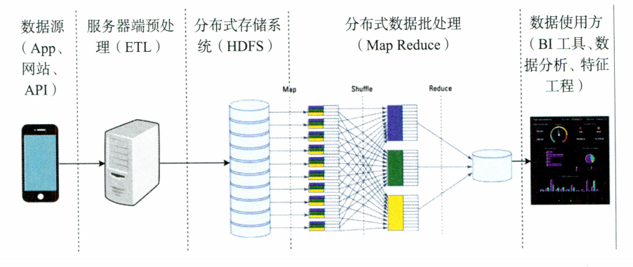

### 1.2 流计算大数据架构

##### 流计算大数据架构在数据流产生以及传递的过程中流式地消费并处理数据。流计算架构中“滑动窗口”是其基本组成单元，在每一个窗口内部，数据被暂时缓存并消费，在完成一个窗口的数据处理之后，流计算平台滑动到下一个时间窗口进行新一轮的数据处理。理论上，流计算平台的延迟仅仅与滑动窗口的大小有关。在流计算的过程中，流计算平台不仅可以进行单个数据流的处理，还可以对多个不同数据流进行融合操作，并在同一个时间窗口内做整合处理。另外，一个流计算环节的输出还可以成为下流应用的输入，整个流计算架构是灵活可重构的。其数据处理的延迟小，数据流的灵活非常强。除此之外，纯流计算的大数据架构摒弃了批处理的过程，这使得平台在数据合法性检查、数据回放、全量数据分析等应用场景之下显得捉襟见肘，特别是在时间窗口较短的情况下，日志乱序、融合操作造成的数据遗漏会使得数据的误差累计。其架构示意图如下所示：

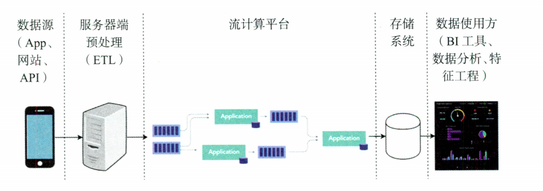

### 1.3 Lambda架构

##### Lambda架构的数据通道从最开始的数据收集阶段裂变为两条分支：实时流数据和离线处理。实时流部分保持了流计算架构，保障了数据的实时性，而离线处理部分则以批处理的方式为主，保障了数据的最终一致性，为系统提供了更多数据处理的选择。其中流计算部分为保障数据实时性更多是以增量计算为主，而批处理部分则对数据进行全量运算，保障其最终推荐系统特征的丰富性。在将数据存入最终数据库之前，Lambda架构往往会对实时流数据和离线层数据进行合并，并会利用离线层数据对实时流数据进行校验和纠错。其架构示意图如下所示：

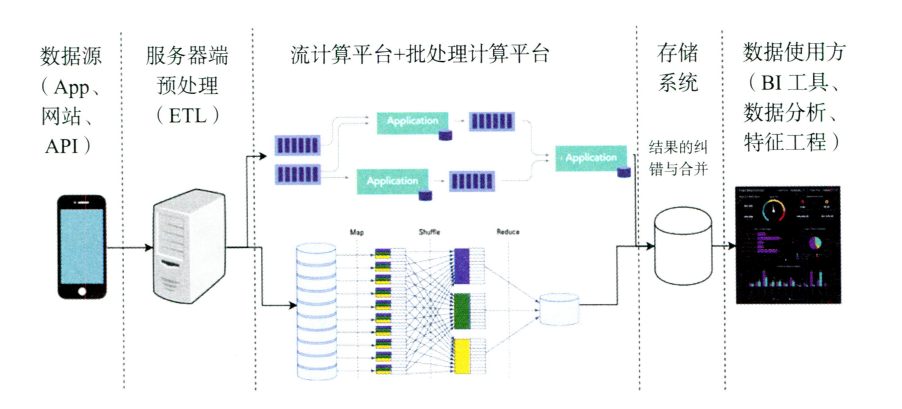

##### Lambda架构通过保留流处理和批处理两条数据处理流程，使得系统兼具实时性和全面性，是目前大部分公司采用的主流框架。但由于实时流和离线流处理部分存在大量逻辑冗余，需要重复地进行编码工作，消费了大量的计算资源

### 1.4 Kappa架构

##### Kappa架构是为了解决Lambda中冗余部分而诞生的。其遵循所有数据都是流式数据的原则。无论是真实的流数据，还是离线批处理，都被以流计算的方式执行。对于原始批处理部分，其实批处理处理的也是一个时间窗口的数据，只不过与流处理相比，这个时间窗口比较大，除此之外，批处理完全可以共享流处理的计算逻辑。现在问题的关键在于如何在离线环境下利用同样的流处理框架进行数据批处理。为了解决这个问题，需要在原有流处理的框架之上加上两个新的通路“原路数据存储”和“数据重播”。第一个通路将未经流处理的数据或者日志原封不动地保存到分布式文件系统中；“数据重播”将这些原始数据按照时间顺序进行重播，并用同样的流处理框架进行处理，从而完成离线状态下的数据批处理。Kappa架构从根本上完成了Lambda架构流处理部分和离线部分的融合，是非常优美和简洁的大数据架构。其架构示意图如下所示：

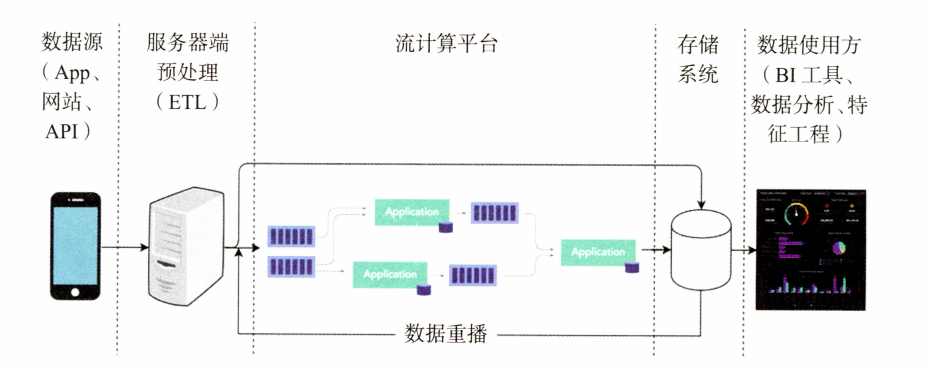

### 1.5 大数据平台与推荐系统的整合

##### 大数据平台与推荐系统的整合主要有两个问题：（1）训练数据的处理；（2）特征的预计算

##### 以HDFS为代表的离线海量数据存储平台，主要负责存储离线训练用的训练样本；（2）以Redis为代表的在线实时特征数据库，主要负责为模型的在线服务器提供实时特征，其整合示意图如下所示：

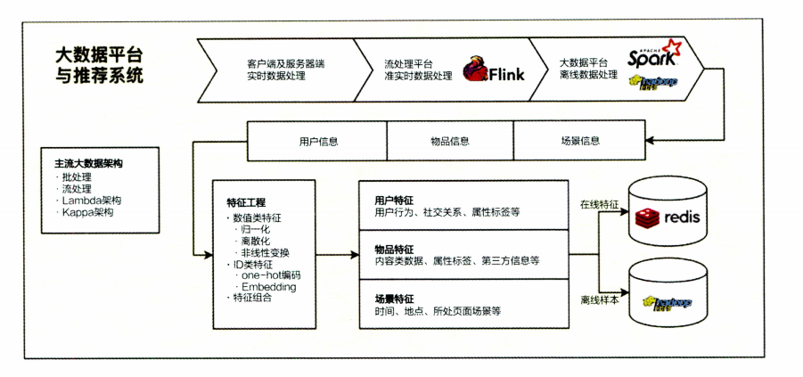

## 2.推荐模型的离线训练

##### 在现实场景中。动辄TB或者PB级别的数据量导致几乎不可能在传统单机环境下完成机器学习模型的训练，分布式机器学习训练成为唯一的选择。

### 2.1 Spark

##### Spark是业界最主流的计算平台，为了照顾数据处理和模型训练平台的一致性，也有大量公司采用Spark原生的机器学习平台MLib进行模型训练。Spark MLlib的并行训练方法代表着一种朴素的、直观的解决方案

#### 2.1.1 Spark的分布式计算原理

##### Spark是一个分布式计算平台。所谓的分布式，就是计算节点之间不共享内存，需要通过网络通信的方式交换数据。其最典型的应用是建立在大量廉价的计算节点之上，这些节点可以是廉价主机，也可以是虚拟的Docker容器（但这种与CPU+GPU的架构不同，也与共享内存多处理器的高性能服务器架构不同）。其架构如下图所示：

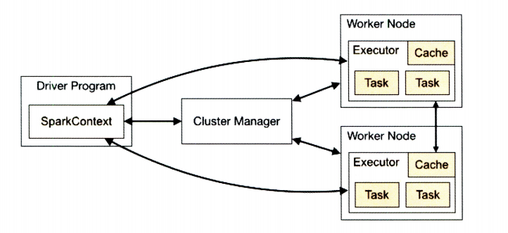

##### 在执行具体的程序的时候，Spark会将程序拆解成一个任务DAG，再根据DAG决定程序各步骤执行的方法。其中最关键的过程是找到哪些是可以并行处理的部分，哪些必须是混洗和删掉的。混洗是指所有数据分片必须进行洗牌后才能得到下一步的数据，这样各个数据分片的部分就可以并行处理，另外删掉是指从数据分片上汇总统计结果，随着数据分片的数量逐渐减少，删除操作的并行度逐渐降低，直到将最终的计算结果汇总到master节点之上。其结构如下图所示：

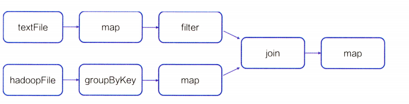

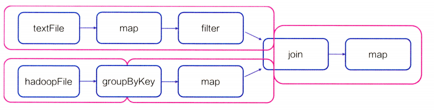

##### 需要注意的是，清洗操作需要在不同的计算节点之间进行数据交换，非常消耗计算、通信以及存储资源。使用一句话进行总结就是，Stage内部数据高效并行计算，Stage边界处进行消耗资源的清洗操作或者最终的删除操作。

#### 2.1.2 Spark MLlib的模型并行训练原理

##### 在所有主流的机器学习模型中，随机森林的模型结构决定了其可以完全进行数据并行的模型训练，而GDBT的结构特点决定了树之间只能进行串行训练。梯度下降的并行程度决定了一逻辑回归为基础，以MLP为代表的深度学习模型的训练速度。Spark的mini batch部分中关键代码如下所示：

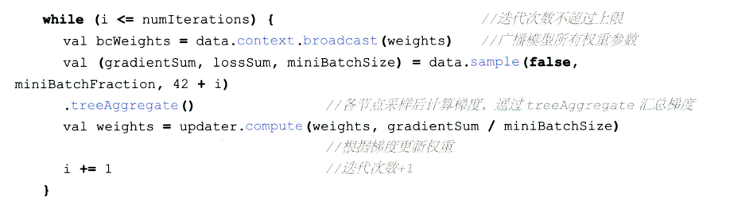

##### 其主要做了以下三件事情：（1）把当前的模型参数广播到各个数据分片部分；（2）每个计算节点进行数据抽样得到小批量的数据，分别计算梯度，再通过树聚合操作汇总梯度，得到最终的梯度；（3）利用最终梯度更新模型权重。这样一来，每次迭代的Stage与Stage的边界就非常清楚了，Stage内部的并行部分是各个节点分别采样并计算梯度的过程。Stage的边界时汇总加上各节点梯度的过程。在迭代次数达到上限或者模型已经充分收敛之后，模型停止训练。其并行训练过程其实是”数据并行“的过程，并不涉及复杂的梯度更新策略，也没有通过”参数并行“的方式实现并行训练。该方式简单、直观、易于实现

#### 2.1.3 Spark MLlib的局限性

##### 使用Spark MLlib进行模型训练在面对复杂神经网络的时候，其训练时间长，而且模型参数过多存在内存溢出的问题。具体来讲，其主要存在以下三个弊端

- ##### 采用全局广播的方式，在每一轮迭代前广播全部参数。其非常消耗带宽资源，特别是当模型的参数规模较大的时候，广播过程和每个节点都维护一个权重参数副本的过程都是极消耗资源的，这导致Spark在面对复杂模型的时候表现不佳

- ##### 采用阻断式的梯度下降方式，每一轮梯度下降由最慢的节点决定。其小批量过程是在所有节点计算完各自的梯度之后，逐层聚合，最红汇总生成全局的梯度。如果数据倾斜等问题导致某一个计算节点的时间过长，那么这一过程会阻断其他所有节点，使得其无法执行新的任务。这也是Spark MLlib并行训练效率较为低下的主要原因

- ##### 其并不支持复杂深度学习网络结构和大量可调参数。其标准库只支持标准MLP的训练，不支持RNN、LSTM等复杂的网络结构，而且无法选择不同的激活函数等大量参数，导致其在支持深度学习方面的能力欠佳

### 2.2 Parameter Server

##### 其主要作用是并行进行梯度下降的计算，完成模型参数的更新直到模型最终收敛。其采取了和Spark MLib一样的思想，先产生局部梯度，再汇总梯度更新参数权重，实现并行化训练。其物理架构如下所示：

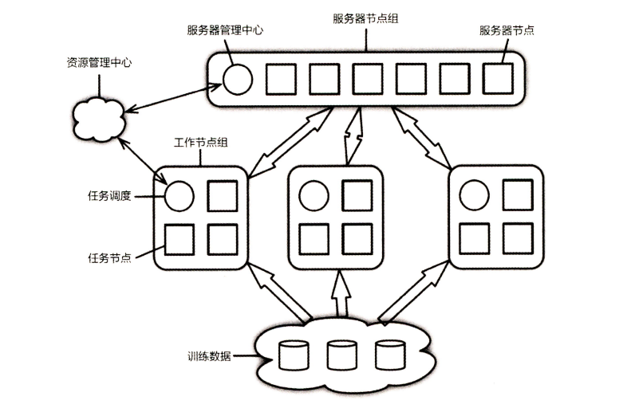

##### 其主要分为两大部分：服务节点组和多个工作节点组。资源管理中心负责总体资源分配调度。服务器节点组内部包含多个服务器节点，每个服务器节点负责维护一部分参数，服务器管理中心负责维护和分配服务器资源。每一个工作节点组对应一个应用（也即一个模型训练任务），工作节点组之间，以及工作节点组内部的任务节点之间并不通信，任务节点只与服务器通信。其并行梯度下降的伪代码如下所示：

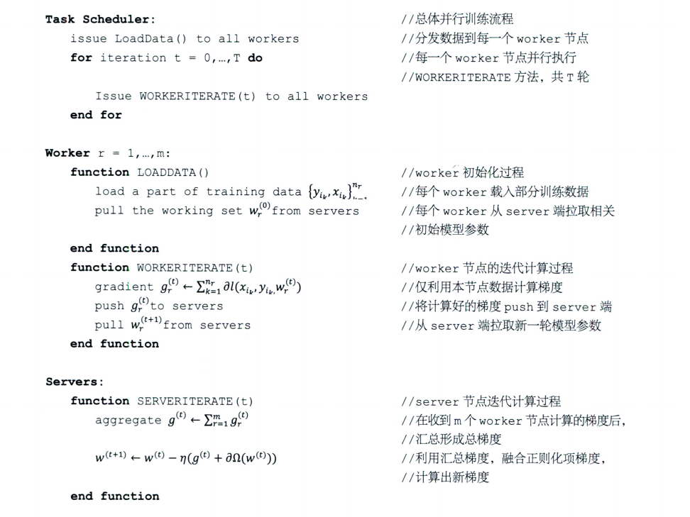

##### 其主要由服务节点与工作节点组成，两者主要功能如下：（1）服务节点主要功能是保存模型参数、接受工作节点计算出的局部梯度、汇总计算全局梯度，并更新模型参数；（2）工作节点的主要功能是保存部分训练数据，从服务节点拉取最新的模型参数，根据训练数据计算局部梯度，上传给服务节点。其并行训练的流程示意图如下所示：

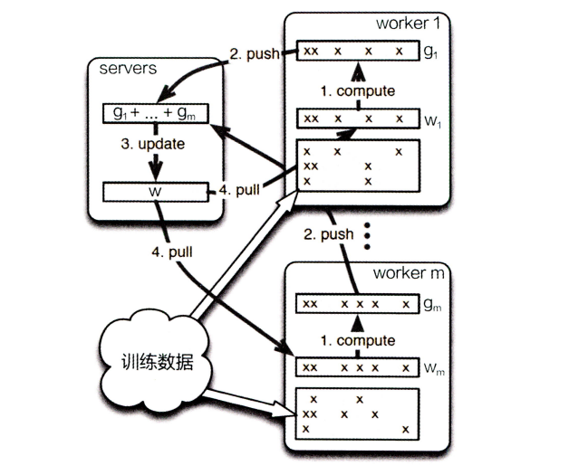

##### 其并行梯度下降流程中两个重要的操作是push和pull。pull操作为了进行下一轮的梯度计算，工作节点从服务节点拉取最新的模型参数到本地；push操作是指工作节点利用本节点上的训练数据，计算好局部梯度，上传给服务器节点

##### 整个Parameter Server的分布式训练流程如下：（1）每一个工作载入一部分训练数据；（2）工作节点从服务节点拉取最新的相关模型参数；（3）工作节点利用本节点数据计算梯度；（4）工作节点将梯度推送到服务节点；（5）服务节点汇总梯度更新模型；（6）跳转到第二部，直到迭代次数到达上限或模型收敛

#### 2.2.1 一致性与并行效率之间的取舍

##### ”同步式阻断“的并行梯度下降是”一致性“最强的梯度下降算法，因为其计算结果与串行梯度下降的结果严格一致。Parameter Server采用”异步非阻断式“的梯度下降代替原来的”同步阻断式“方法。异步梯度更新的方式虽然大幅加快了训练速度，但其带来的是模型一致性的损失，这样的不一致会对模型收敛的速度造成一定影响。最终选取更新方式主要依赖于不同模型对一致性的敏感程度；另外再同步与异步之间可以设置”最大延迟“等参数限制异步计算的程度

#### 2.2.2 多服务节点的协同与效率问题

##### 导致Spak MLlib训练效率低下的另外一个原因是每次迭代都需要master节点将模型权重参数广播到每一个工作节点上，这会导致以下两个问题：（1）master节点作为一个瓶颈节点，受限于带宽，发送全部的模型参数的效率不高；（2）同步地广播发送所有权重参数，使得系统的整体网络负载非常大。Parameter Server使用key-value的字典形式，每一个服务只需要负责一个参数键范围内的参数即可。如何决定每一个server负责那一部分的参数以及如何在有新的server加入的时候，保证已有的参数范围不发生大的变化加入新的节点是两个比较重要的问题。这两个问题的答案涉及一致性哈希的原理。Parameter Server节点组成的一致性哈希环如图所示：

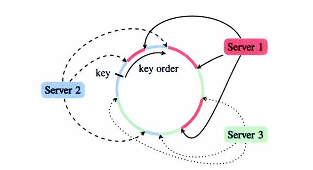

##### 应用一致性哈希管理参数的过程大致有以下几个步骤：

- ##### 将模型的参数的key映射到一个环形的哈希空间中，只要保证首尾相连即可

- ##### 根据服务节点的数目n，将环形哈希等分成nm个范围，让每一个服务间隔地分配m个哈希范围。这样做是为了保证一定的负载均衡，避免哈希值过于集中带来的服务负载不均的问题

- ##### 在新加入一个服务节点时，让加入的服务节点找到哈希换上的插入点，让新的服务负责插入点到下一个插入点之间的哈希范围，这样做相当于把原来的某一段哈希范围分成两份，新的节点负责后半段，原来的节点负责前半段。这样不会影响其他哈希范围的哈希分配，自然不存在大量的重复哈希带来的数据大混洗的问题

- ##### 删除一个服务节点的时候，移除该节点相关的插入点，让临近节点负责该节点的哈希范围

##### Parameter Server技术要点总结：

- ##### 用异步非阻断的分布式梯度下降策略替代同步阻断式的梯度下降策略

- ##### 实现多服务器节点的架构，避免单master节点带来的带宽瓶颈和内存瓶颈

- ##### 使用一致性哈希、参数范围拉取、参数范围推送等工程手段实现信息的最小传递，避免广播操作带来的全局性网络阻塞和带宽浪费

### 2.3 TensorFlow

##### TensorFlow根据深度学习模型架构构建一个有向图，让数据以张量的形式在其中流动起来。张量其实是矩阵的高维扩展，矩阵可以看作张量在二维空间上的一个特例。对于每一个深度学习模型，需要根据其结构建立一个由点和边组成的有向图，其中每一个点代表着某一种操作，比如池化操作、激活函数等。每一个点可以接收0个或者多个张量，并产生0个或者多个输出张量，这些张量就沿着点之间的有向边的方向流动，直到最终的输出层。下图为一个简单的TensorFlow有向图：

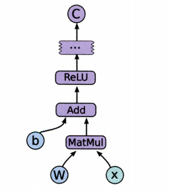

#### 2.3.1 TensorFlow基于任务关系图的并行训练过程

##### 在构建完各”操作“构成的任务关系图，TensorFlow就可以基于任务关系图进行灵活的任务调度，以最大的限度地利用多GPU或者分布式计算节点的并行计算资源。利用任务关系图进行调度的总原则是：存在依赖关系的任务节点或者子图之间需要串行执行，不存在依赖关系的任务节点或者子图之间皆可以并行执行

#### 2.3.2 TensorFlow的单机训练和分布式训练模式

##### TensorFlow的计算平台分为两种不同的模式，一种是简单的单机训练，另外一种是多机分布式训练。对于单机训练来说，虽然执行过程也包括CPU、GPU的并行计算过程，但总体上处于共享内存的环境，不用过多考虑通信问题；多机分布式训练指的是多台不共享内存的独立计算节点组成的集群环境下的训练方法，计算节点需要依赖于网络通信。其单机训练是一个在工作节点上进行的，单工作节点内部按照任务关系图的方式在不同的CPU和GPU节点间进行并行计算；对于分布式环境来说，平台在多个工作节点，可以采用数据并行的方式进行训练。也就是说，每一个工作节点以同样的任务关系图的方式进行训练，但是训练数据不同，产生的梯度汇总后进行更新，其图示如下所示：

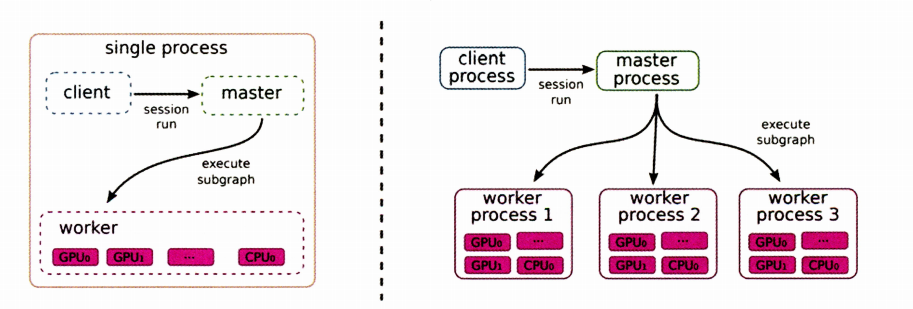

##### GPU拥有多核的优势，因此在处理矩阵加、向量乘等张量运算的时候，相比CPU有巨大优势，在处理一个任务节点或者任务子图时，CPU主要负责数据和任务的调度，而GPU则负责计算密度集高的张量运算

#### 2.3.3 TensorFlow技术要点总结

- ##### TensorFlow主要原理是将模型训练过程转换成任务关系图，让数据以张量的形式在任务关系图中传递

- ##### 其基于任务关系图进行任务调度和并行计算

- ##### 其并行训练分为两层，一层是基于Parameter Server架构的数据并行训练过程，一层是每一个工作节点内部CPU+GPU任务级别的并行计算过程

## 3. 推荐模型上线部署

### 3.1预存推荐结果或者Embedding结果

##### 对于推荐系统线上服务来说，最简单直接的方法是在离线环境下生成每个用户的推荐结果，然后将结果预存到Redis等线上数据库中。在线上环境直接取出预存的数据推荐给用户即可。该方法优缺点如下：

- ##### 无须实现模型线上推断过程，线下训练平台于线上服务平台完全解耦，可以灵活地选择任意的离线模型进行训练

- ##### 线上服务过程没有复杂计算，推荐系统的线上延迟极低

- ##### 在数量级别大的情况之下，容易发生组合爆炸的情况，线上数据库无法支撑如此巨大规模数据的存储

- ##### 无法引入线上场景类特征，推荐系统的灵活性和效果受限

### 3.2 自研模型·线上服务平台

##### TensorFlow等通用平台为了灵活性和通用性的要求，需要支持大量冗余的功能，导致平台过重，难以修改和定制。自研平台的好处是可以根据自身的业务和需求进行定制化的实现，并且兼顾模型服务的效率；另外当模型的需求比较特殊时，大部分深度学习框架无法支持，这些线上服务方法一般需要自研。自研平台由于模型的时间成本较高，自研一两种模型是可行的，但是当模型数量增大的时候，模型的比较以及参数的调优就变得比较困难

### 3.3 预训练Embedding+轻量级线上模型

##### 现实场景中，往往采用离线训练复杂网络并生成Embedding存入内存数据库、线上实现逻辑回归或者浅层神经网络等轻量级模型拟合优化目标的上线方案。双塔模型分别使用复杂网络对“用户特征”和“物品特征”进行Embedding化，在最后的交叉层之前，用户特征和物品特征之间没有任何交互，这就形成了两个独立的“塔”。在完成双塔模型的训练之后，可以把最终的用户Embedding于物品Embedding存入内存数据库。最终进行线上预测的时候取出对应的Embedding即可

### 3.4 利用PMML转换并部署模型

#### Embedding加轻量级模型的训练方式是实用且高效的，但无论如何还是割裂了模型，无法实现端到端的模型训练和端到端的模型部署。PMML的全称是预测模型标记语言，是一种通用的以XML的形式表示不同的模型结构参数的标记语言。在模型上线过程中，其经常作为中间媒介连接离线模型训练平台和线上测评平台，下图为Spark MLlib模型利用PMML的上线过程示意图：

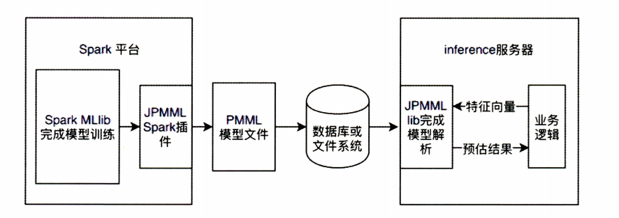

### 3.5 TensorFlow Sevring

##### TensorFlow Serving是TensorFlow推出的原生模型服务器。TensorFlow定义了自身的模型序列化标准。利用TensorFlow自带的模型序列化函数可以将训练好的模型参数和机构保存至某文件路径。其最普遍也是最便捷的服务方式是Docker建立模型服务API。准备好Docker环境之后，仅仅需要通过拉取镜像的方式即可完成TensorFlow Serving的环境的安装