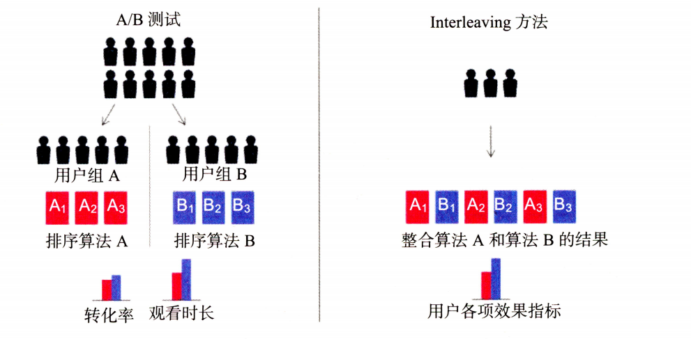

# Others

## 1. 推荐系统的评估

###### （1）推荐系统评估所采用的指标直接决定了推荐系统的优化方向是否符合客观实际

##### （2）推荐系统评估是机器学习团队与其他团队沟通合作的接口性工作

##### （3）推荐系统的评估指标的选取直接决定了推荐系统是否符合公司的商业目标和发展愿景

### 1.1 离线评估方法与指标

#### 1.1.1 离线评估的主要方法

###### Holdout检验：其将原始的样本集合随机划分为训练集与验证集两部分。其缺点是在验证集上计算出来的评估指标与训练集和验证集的划分有直接关系，其结果因为划分数据集的方法存在较大的随机性

##### k折交叉检验：先将全部样本划分为k个大小相等的样本子集，依次遍历这k个子集，每次把当前子集作为验证集，其余所有子集作为训练集，进行模型的训练与评估，最后将所有k次的评估指标的平均值作为最终评估指标

##### 留一验证：每次留下一个样本作为验证集，1其余所有样本作为训练集。样本总数为n，依次遍历所有n个样本，进行n次验证，再将评估指标求平均得到最终指标。在样本数目较多的情况下，其开销较大

##### 自助法：基于自助采样的检验方法，对于总数为n的样本集合，进行n次有放回的随机抽样，得到大小为n的训练集。在n次采样过程中，有的样本会被重复采样，有的样本不会被采集到，将没有被选中的样本作为验证集

#### 1.1.2 离线评估指标

##### 准确率：分类准确的样本数占据所有样本数的比例

##### 精确率与召回率：精确率是指分类正确的样本占据分类器判定为正样本的样本个数的比例；召回率是指分类正确的样本数目占真正的正样本的数目的比例

##### 精确率与召回率是矛盾统一的两个指标，为了提高精确率，分类器需要尽量在更高精度的情况下将样本预测为正样本，但往往会因为过于要求精度而漏掉很多正样本，导致召回率较低

##### F1-score:其是精确率与召回率的调和平均值

##### 均方根误差：其经常被用来衡量回归模型的好坏，正常情况下，其能够反映回归模型预测值与真实值的偏离程度，但是其不擅于处理存在离群点的数据，即使离群点数据非常少，也会使得均方根误差变得很差

##### 平均绝对误差：其相对于均方根误差对于每一个点的误差进行了归一化，降低了个别离群点带来的绝对误差的影响

##### 对数损失函数：对数损失函数经常用于离线评估，其就是逻辑回归的损失函数，大多数模型的最后一层都需要经过softmax，因此采用对数损失函数作为评估指标能够非常直观的反映模型损失函数的变化

##### P-R曲线：P-R曲线的横轴是召回率，纵轴是精确率。对于一个排序模型来说，其P-R曲线上的一个点代表“在某一个阈值下面，模型将大于该阈值的结果判定为正样本，将小于该阈值的结果判定为负样本时，排序结果对用的召回率与精确率”。在绘制好P-R曲线后，计算曲线下的面积能够量化P-R曲线的优劣。AUC指的是P-R曲线下的面积大小。AUC越大，排序模型效果越好

##### ROC曲线：其横坐标为假阳率，纵坐标为真阳率。ROC曲线定义较为复杂，其与P-R曲线一样也是通过不断移动模型正样本阈值生成的。

##### 平均精度均值：其对平均精度的再次平均。平均精度是指根据正样本的精确度进行平均，如果是对所有用户在求一次平均就是平均精度均值

##### 其他评估指标： 归一化折损累计增益、覆盖率、多样性等，常用的评估指标参看：[link](https://github.com/QinHsiu/Trick/tree/main/evaluation_metric)

### 1.2 离线评估仿真方法

##### 离线评估的重点是让离线评估指标的结果最终能够尽量接近线上结果。离线评估的逻辑闭环如下所示：

#### 1.2.1 动态离线评估方法

##### 动态离线评估方法先根据样本产生时间对测试样本由早到晚进行排序，再用模型根据样本时间依次进行预测。在模型更新的时间点上，模型需要增量学习更新时间点前的测试样本，更新后继续进行后续的评估。两者的对比如下图所示：

##### Netflix的Replay评估方法-时光机

##### 从上图可以看出，该方法是以天为单位进行启动的，其主任务的主要功能是把当天的各类日志、特征、数据整合起来，形成当天的供给模型训练和评估所使用的样本数据

### 1.3 线上A/B测试方法和线上评估

##### A/B测试又叫分流测试与分桶测试，是一个随机实验，通常被分为实验组和对照组。在利用控制变量法保持单一变量的前提之下，将A、B两组数据进行对比，得出实验结论。A/B测试的主要核心点包括：

- ##### 离线评估无法完全消除数据有偏现象的影响，因此得出的离线评估结果无法完全代替线上评估结果

- ##### 离线评估无法完全还原线上的工程环境，离线评估没有考虑线上环境的延迟、数据丢失、标签数据缺失等情况，因此离线评估环境只能说是理想状态下的工程环境，其得出的结果存在一定的失真现象

- ##### 线上系统的某些商业指标在离线评估中无法计算。离线评估一般针对模型本身进行评估，无法直接获得与模型相关的其他指标，特别是商业指标。线上评估可以全面了解该模型的用户点击率、留存时长、PV访问量等的变化

##### A/B测试的分桶原则：在A/B测试的分桶过程中需要注意的是样本的独立性与采样方式的无偏性：同一个用户在测试的全过程中只能被分到同一个桶中，在分桶过程中所用的用户ID应该是一个随机数，这样才能保证桶中的样本是无偏的

##### A/B测试分层与分流的机制：（1）层与层之间的流量正交，层与层之间的独立实验的流量是正交的，即实验中每一组的流量穿越该层之后，都会被再次随机打散，且均匀地分布在下层实验的每一个实验组中；（2）同层之间的流量互斥，一方面如果同层之间进行多组的A/B测试，那么不同测试之间的流量是不重叠的，另外一方面一组A/B测试中实验组和对照组的流量不是重叠的，是互斥的。互斥的含义是不同实验之间的用户应该是不重叠的

##### 线上A/B测试的评估指标如下所示：

### 1.4 快速线上评估测试方法

##### Interleving是一种快速线上评估方法，其从大量的初始想法中筛选出少量优秀的推荐算法，再对缩小的算法集合进行传统的A/B测试，用以测量它们对用户行为的长期影响，使用该方法进行快速线上测试的示意图：

##### 在互联网中，非常活跃的用户往往是少数，但其贡献量（浏览网页、观看影视）却占比较大，因此在做A/B测试的时候忽略这些隐藏信息，可能会导致两者结果差异较大。解决的办法就是不对人群进行划分，也即不区分A/B组，而是把所有的测试对象看作一个整体，然后将被测对象同时展现给受试者（测试对象），最后根据受试者偏好得出评估结果。传统A/B测试与Interleving的比较如下所示：

##### 在使用该方法的时候需要考虑位置偏差的存在，避免来自算法A的结果总是排在第一个位置，需要对排序结果进行整合。在验证该方法的有效性需要从两个方面考虑：灵敏度和正确性。灵敏度是指判断该方法较传统A/B测试方法需要多少样本就能够判断出不同算法的好坏（考虑到线上资源有限的原因，当然是需要越少的样本越好）；正确性是指该方法的判断结果是否与A/B测试的结果一致。

##### 该方法的优点：所需要的样本数目少，测试速度快，结果与传统A/B测试的结果无明显差异；

##### 该方法的局限性：（1）工程实现的框架较于传统A/B测试更加复杂，其逻辑可能会对业务逻辑产生干扰，并且需要大量的辅助性数据标识，工程实现难度较大；（2）其只是对”用户对算法推荐结果偏好程度“的相对测量，并不能得出一个算法的真实表现，无法知道不同算法具体的效果

##### 推荐系统的评估体系如下所示：

## 2. 推荐系统前沿实践

### 2.1 FaceBook GDBT+LR组合模型

##### 该方法主要贡献有以下几点：（1）特征工程模型化，利用模型进行特征的自动组合和筛选；（2）模型复杂性和时效性的权衡，对于GDBT和LR采用不同的更新频率；（3）不管做什么实验都需要数据实验结果作为支撑

### 2.2 FaceBook深度学习模型DLRM

##### 比较与GDBT+LR模型，DLRM是一次彻底的应用深度学习模型的尝试，其模型结构如下所示：

##### 所有特征工程可以被划分为两类：一类是类别、id特征使用独热编码生成的系数特征；另外一类是数值连续型特征；对于Embedding层，在每一个类别转换为独热向量之后，用Embedding层将其转换成维度为n的Embedding向量，对于连续型特征使用MLP将其转换成维度为n的向量。对于神经网络层，在得到维度为n的特征向量之后，再经过神经网络进行进一步的转换。对于特征交互层，将之前得到的特征表示进行两两做内积，再与之前的连续型对应的特征表示进行连接，最后输入MLP，其目的是让特征进行充分的交叉。目标拟合层，将前面得到的表示再放入一个神经网络，最后使用sigmoid激活函数给出最终的点击率预估

#### 2.2.1 模型并行训练方法

##### DLRM融合使用了模型并行和数据并行的方法，对于Embedding部分采用了模型并行，对于MLP部分采用了数据并行。对于Embedding部分采用模型并行的原因是减轻大量Embedding层参数带来的内存瓶颈问题。MLP部分采用数据并行可以进行前向和反向传播。Embedding并行训练指的是一个设备或者计算节点，仅仅保存一部分Embedding层参数，每一个设备进行并行小批量的梯度更新时，仅仅更新自己节点上的部分Embedding层参数。MLP层和特征交互层进行数据并行是指在每一个设备上已经有了全部的模型参数，每一个设备利用部分数据计算梯度，再利用全量规约的方法汇总所有梯度进行参数更新

### 2.3 Airbnb基于Embedding的实时搜索推荐系统

##### 租客与房主之间的交互形式包括以下几种：（1）租客点击房源；（2）租客立即预定房源；（3）租客发出预定请求，房主可以选择拒绝、同意或者不响应租客的预定请求。其交互图如下所示：

##### 其对用户的长短期兴趣使用了不同的Embedding进行初始化。对于用户的短期兴趣，其利用session内点击的数据对房源进行Embedding，捕捉用户的一次搜索过程中的短期兴趣。其中session内会话是指用户在一次搜索过程中点击的房源，其主要需要满足以下两个条件：（1）只有在房源详情页停留超过30s才算序列中的一个数据点；（2）如果用户超过30分钟没有动作，就结束这次会话；怎么做的目的有两个，第一个是清洗噪音点和负反馈信号；第二个是避免非相关序列的产生。有了序列之后，就可以使用Iten2vec对序列id进行Embedding。注意每一个预定会话只有最后一个房源是被预定房源。对于用户的长期兴趣，其使用预定会话序列，将用户过去一个时间段内所有的预定房源id组合为一个序列，这里不能直接r使用item2vec的方法直接获取Embedding表示，主要是因为数据过于稀疏的原因，其主要表现在以下几点：（1）预定行为本身的总体数量远远小于点击行为，预定会话集合远远小于点击行为集合；（2）单一用户的预定行为很少，大量用户在过去只是预定过一个房源；（3）大部分房源被预定的次数少的可怜，这样导致数据极其稀疏。其解决办法是使用分桶技术对用户和房源进行分桶，简单来讲就是利用相关属性对用户和房源进行聚合，将预定了相似的用户归为一类，将相似的房源归为一类，最后以二元组的形式放进模型，其形式如下所示：((user_type1,list_type1),(user_type2,list_type2),...,(user_typen,list_typen))，为了使得两者最终获得的Embedding表示位于同一个向量空间之中，其对两者使用了相同的目标函数进行构建，其会丢失一些信息，但是很好解决了对于用户长期兴趣建模的数据稀疏的问题

#### 2.3.1 Airbnb实时推荐系统总结

##### 首先其过程与理论相结合，改进word2vec，获取用户和房源Embedding，并针对数据稀疏的问题，利用补充信息（用户属性与房源属性）聚合稀疏数据；业务与知识结合，引入与业务强相关的目标项，使得算法的改造与公司业务和商业模型紧密结合

### 2.4 YouTube深度学习视频推荐系统

##### YouTobe平台中几乎所有的视频都来自用户自己制作，这样的内容生产模式有两个特点：（1）商业模式不同，像Netflix和爱奇艺等流媒体，大部分内容都来自于采购或者自制的视频等头部内容，YouTube头部内容没有那么明显；（2）YouTube的视频基数大，用户较难发现喜欢的内容。因此，YouTube内容的特点使得其推荐系统的作用要比其他流媒体重要得多。因为用户和视频基数大的问题，其不适合采用复杂的网络直接对海量视频进行排序，其使用两级深度学习模型完成整个推荐过程，其结构如下所示：

#### 2.4.1 候选集生成模型

##### 候选集模型的输入是用户历史观看视频的Embedding向量和搜索词的Embedding向量，为了生成两个Embedding，其方法与Airbnb Embedding方法类似，利用用户的观看序列和搜索序列，采用Word2vec的方式对视频和搜索词做Embedding，再作为候选集生成模型的输入，另外除了上述两种向量，特征向量还包括地理属性特征Embedding、年龄、性别等。然后把所有特征连接起来，输入上层的ReLU神经网络进行训练。三层神经网络过后，使用softmax函数作为输出层，其模型的输出为一个在所有候选视频上的概率分布，其结构如下所示：

#### 2.4.2 候选集生成模型的线上服务办法

##### 候选集生成模型生成的Embedding候选集再经过最近邻搜索选出最终的推荐列表，这样可以使得不需要把模型推断的逻辑放进服务器，只需要将学到的Embedding表示存到内存数据库或者服务器内存中就好，使用局部敏感哈希等方法甚至可以把模型服务的计算复杂度降低到常数级别

#### 2.4.3 排序模型

##### 排序模型可以引入更多的特征辅助排序，具体来说，其输入层从左至右依次是：（1）当前候选视频的Embedding；（2）用户看过的最后N个视频Embedding的平均值；（3）用户语言的Embedding和当前候选视频语言的Embedding；（4）该用户自上次观看同频道视频的时间；（5）该视频已经曝光给该用户的次数。后面两个原特征值的引入，并进行了开方和平方的处理，作为新的特征输入模型，这一操作引入了特征的非线性性，提升了模型对特征的表达能力

##### 经过三层ReLU激活函数之后，排序层的输出层与候选集生成模型的有所不同，候选集生成模型使用softmax作为其输出层，排序模型选择加权逻辑回归作为模型输出层，因为其目标是增加用户观看时长，所以需要将每次曝光期望观看时长作为合适的优化目标。为了直接预估观看时长，其将正样本的观看时长作为其样本权重，使用加权逻辑回归进行训练，就可以让模型学到用户观看时长的信息

#### 2.4.4 训练和测试样本的处理

##### YouTube模型处理训练样本的工程措施主要有以下几点：（1）候选集生成模型将推荐问题转换为多分类问题，在预测用户下一次观看的场景中，对每一个备选视频都是一个分类，针对分类数目巨大的问题，其采用Word2vec方法中采用的负采样训练方法减少每次预测的分类数量，从而加快整个模型的收敛速度；（2）在对训练集的预处理过程中，没有采用原始的用户日志，而是对每一个用户提取相等数量的训练样本，这样做可以减少高度活跃用户对模型损失的过度影响，使得模型过于偏向于活跃用户的行为模式，忽略数量更为广大的长尾用户的体验；（3）在处理测试集的时候，其没有采用经典的留一法，而是以用户最近的一次观看的行为作为测试集，这样可以有效避免引入未来信息，产生于事实不符合的数据穿越问题

##### 2.4.5 处理用户对视频的偏好

##### 用户对于视频的偏好很明显，对于绝大多数内容来说，刚刚上线那段时间是其流量高峰期，然后快速衰减最后趋于平稳。为了拟合用户对新内容的偏好，该推荐系统引入了训练样本产生的时刻距离当前时刻的时间这一特征，其选择这样一个时间特征来反映内容新鲜程度的逻辑并不易于理解，该特征并不包含任何信息，但是当该特征在深度神经网络中与其他特征做交叉的时候，就起到了时间戳的作用，通过该特征与其他特征的交叉，保存了其他特征随时间变化的权重，也就使得最终的预测包含了时间趋势的信息

### 2.5 阿里深度学习推荐系统

##### 阿里推荐模型的体系演进过程如下所示：

#### 基础深度学习模型使用经典的Embedding技术+MLP深度学习模型架构，其将用户历史特征的Embedding进行简单相加或者池化操作，然后与其他特征连接之后输入上层的神经网络进行训练，结构如下所示：

##### DIN模型利用注意力机制替换基础模型的叠加池化操作，根据候选广告和用户历史行为之间的关系确定每一个历史行为的权重，其模型结构如下所示：

##### DIEN模型在DIN的基础上，进一步对用户行为历史的建模，使得序列模型在用户行为历史之上抽取用户兴趣并模拟用户兴趣的演化过程，其结构如下所示：

##### MIMN在DIEN的基础之上，将用户的兴趣细分为不同兴趣通道，进一步模拟用户在不同兴趣通道上的演化过程，生成不同兴趣通道的记忆向量，再利用注意力机制作用于多层神经网络，模拟结构如下所示：

#### 2.5.1 模型服务模块的技术架构

##### 针对复杂模型，模型服务一直是业界的难点。使用一些近似的手段简化模型，会让模型效果受损；端到端地将复杂模型搬到线上，使得服务的延迟居高不下，影响用户体验，阿里提出使用实时模型架构，其如下所示：

##### b架构将a架构中的”用户行为特征在线数据库“替换成了”用户兴趣表达在线数据库“。DIEN或者MIMN表达用户兴趣的最终形态都是兴趣Embedding向量，如果在线获取的是用户行为序列，那么对于实时预估服务器来说还需要运行复杂的序列模型推断过程生成用户兴趣向量；如果在线获取的是用户兴趣向量，那么实时预估服务器就可以跳过序列建模阶段，直接开始MLP阶段的运算，其便于计算，使得整个实时预估的延迟可以大幅减少；b架构新增加了一个服务模块，用户兴趣中心，其用于根据用户的行为序列生成用户的兴趣向量，对于DIEN和MIMN来说，其运行着生成用户兴趣向量的部分模型。另外用户实时行为事件的更新方式也随之变化，对于a架构来说，一个新的用户行为时间发生时，该事件会被插入用户行为特征数据库中，而对于b架构来说，新的用户行为事件会触发其更新逻辑，其会利用该事件更新对应用户的兴趣Embedding表示，其他部分两者基本一致

##### 对于离线部分，学习模块定期利用系统日志文件训练并更新模型，模型更新之后，新的模型在架构a中直接部署在实时预估服务器中；而b架构则是对模型进行拆分，生成用户兴趣向量的部分部署在UIC，其余部分部署在实时预估服务器

##### 对于离线部分：（1）流量请求到来，其中携带了用户ID和待排序的候选商品；（2）实时预估服务器根据用户ID和候选商品ID获取用户特征和商品特征；（3）实时预估服务器利用用户和商品特征进行预估和排序，返回最终排序结果

##### 推荐系统的知识架构图如下所示：

##### 推荐算法工程师的能力进阶

