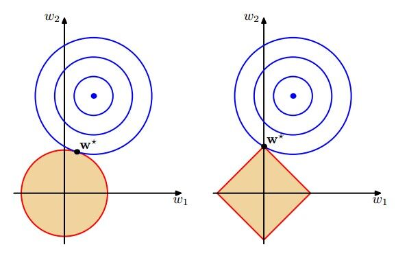

# 传统推荐模型（Traditional Recommendation Model）

## 协同过滤（CF）

## 1. User CF

#### 定义：基于用户之间的相似度来选取与目标用户相似的Top K个用户，然后从其中挑选目标用户没有购买过的商品进行推荐

#### 公式（1）：

#### $$sim(i,j)=\cos(i,j)=\frac{i\cdot j}{||i||\cdot||j||}$$ （基于余弦相似度，该方法存在用户评分偏置的情况）

#### 公式（2）：
$$sim(i,j)=\frac{\sum\limits_{p\in P}(R_{i,p}-\overline{R_{i}})(R_{j,p}-\overline{R_{j}})}{\sqrt{\sum\limits_{p \in P}(R_{i,p}-\overline{R_{i}})}\sqrt{\sum\limits_{p\in P}(R_{j,p}-\overline{R_{j}})}}$$（基于皮尔逊相关稀疏，该方法考虑了用户的平均分来缓解评分偏置）

#### 公式（3）：
$$R_{u,p}=\frac{\sum\limits_{s \in S}(W_{u,s}\cdot R_{s,p})}{\sum\limits_{s\in S}(w_{u,s})}$$（最后使用选取Top K个相似的用户来预测目标用户的打分情况）

#### 优点：结果符合直觉理解，相似的用户有相同的偏好；

#### 缺点：1.真实应用场景中，用户数目远远多于商品数目，假设用户数目为N，则需要N方的空间来存储用户之间的相似度，用户快速的增长会导致需要更大的存储空间；2.用户的历史数据往往非常稀疏，对于交互极其稀疏的用户，很难准确地找到与该用户相似的用户（大部分可能都是错误的），这使得UserCF不适用于那些正反馈获取较困难的场景（例如酒店预订、大件商品购买等低频应用）

## 2. ItemCF

#### 定义：基于物品相似度进行商品推荐，通过计算共现矩阵中物品列向量的相似度来获取相似度矩阵

#### 步骤：（1）根据用户历史行为交互数据，构建UxI矩阵（U：用户数目，I：商品数目）；（2）计算共现矩阵按列两两之间的相似度（相似度计算公式见（1）、（2）），构建IxI的物品相似性矩阵；（3）获取目标用户的正反馈列表，利用该列表在物品相似性矩阵中找出Top K个相似的物品（构成候选集）；（4）在候选集中更具相似度得分进行排序，完成推荐

#### 公式（4）：
$$R_{u,p}=\sum\limits_{h \in H}(w_{p,h}\cdot R_{u,h}),H表示目标用户正反馈集合,w_{p,h}表示物品p与物品h的相似度,R_{u,h}是目标用户对物品h的已有评分$$

### UserCF与ItemCF应用场景比较

#### UserCF基于用户相似度进行推荐，其具备较强的社交特性，用户能够快速得知与自己相似的用户最近喜欢什么，即使某个兴趣点不在自己兴趣范围之内，也有可能通过“朋友”的动态快速更新自己的推荐列表，非常适用于新闻推荐场景，因为新闻的及时性和热点性相较于用户的兴趣点更加重要；ItemCF适用于 兴趣变化较为稳定的场景（用户在一个较短周期内的兴趣是稳定的），比如电商推荐、视频推荐

### 协同过滤所面临的壁垒

#### 协同过滤是一个直观、可解释性很强的模型，但其泛化能力较弱（无法将两个物品相似这一信息推广到其他物品的相似性计算上）。这会导致一个严重的问题，热门的物品具有很强的头部效应，容易和大量物品相似；而尾部的物品由于特征稀疏，很少与其他物品产生相似性，导致被推荐的机会很少。这暴露了协同过滤的天然缺陷：推荐结果的头部效应明显，处理稀疏向量的能力弱。另外协同过滤只考虑了用户的交互信息，没有考虑用户的属性信息、商品的属性信息以及附带的社会关系等一系列特征，这会造成有效信息的遗漏

## 3. MF

#### 矩阵分解在协同过滤的共现矩阵的基础上引入了隐向量，加强了模型处理稀疏矩阵的能力

#### 定义：为每一个用户和商品生成一个隐向量，将用户和商品定义到生成的隐向量表示空间上，距离相近用户和商品表示兴趣特点接近，将距离相近的商品推荐给目标用户。可以通过矩阵分解协同过滤的共现矩阵来获取用户和商品的隐向量。该方法将大小为UxI的共现矩阵分解为UxK的用户矩阵和KxI的商品矩阵相乘的形式，其中K表示隐向量的维度；K的大小决定了隐向量表达能力的强弱。其中K取值越小，其所包含的信息量越少其泛化程度越高，反之，K值越大，其所包含的信息量就越多，其泛化程度越低。此外，K的取值还与矩阵分解的求解复杂度相关

#### 公式（5）：
$$\hat{r}_{ui}=q^{T}_{i}p_{u},其中p_{u}表示用户u在用户矩阵U中对应的行向量，q_{i}是物品i在物品矩阵V中对应的列向量$$

#### 方法：矩阵分解的三种方法（特征值分解（只能用于方阵）、奇异值分解、梯度下降）

### 3.1 奇异值分解

#### 步骤： 给定一个共现矩阵M，其大小为UxI，其一定有M=AxBxC，其中A是UxU的正交矩阵，C是一个IxI的正交矩阵，B是一个UxI的对焦矩阵，取对角矩阵B中较大的K个元素作为隐含特征，删除B中的其他维度以及A和C中对应的维度，矩阵M等价于QxWxE，其中Q，W，E分别为A，B，C中剔除不重要特征之后的矩阵，Q大小为UxK，W大小为KxK，E大小为KxI

#### 目标：该方法的目标是让原始评分与用户向量和物品向量之积的差尽量小，最大限度保存共现矩阵的原始信息

#### 公式（6）：
$$\min\limits_{q^{x},p^{x}}\sum\limits_{(u,i)\in K}(r_{u,i}-q^{T}_{i}p_{u})^{2},其中K表示用户评分样本的集合$$

#### 公式（7）：
$$\min\limits_{q^{x},p^{x}}\sum\limits_{(u,i)\in K}(r_{u,i}-q^{T}_{i}p_{u})^{2}+\lambda(||q_{i}||^{2}+||p_{u}||^{2})，为了防止过拟合，加入正则项$$

#### 缺陷：奇异值分解需要原始矩阵是稠密的，现实场景中共现矩阵M是非常稀疏的，若使用奇异值分解，需要对一些缺失值进行填充；传统奇异值分解的计算复杂度达到了UI方的级别，这对于商品数量多的场景显然无法接受

#### Tips：正则化，其目标是让训练出来的模型更加”规则“、更加稳定，避免预测一些不稳定的”离奇“结果；过拟合就是模型在学到了数据的基本特征之后，在一些个别”噪音点“学到一些浮夸的特征的现象；将正则化项引入损失函数可以保持模型的稳定，例如，当模型的权重过大的时候，损失函数的值越大，梯度下降是朝着减少损失函数的方向发展的，因此引入正则项的目的是想在尽量不影响模型效果的情况之下，尽量减少模型的权重；权重的减少自然会让模型的输出波动减少，常见的正则方法参看：[正则化方法](https://github.com/QinHsiu/Trick/tree/main/similarity_distance)

#### 梯度下降：（1）确定目标函数；（2）对目标函数进行梯度下降，对目标函数（7）求偏导有：

$$\Delta q_{i}=2(r_{ui}-q^{T}_{i}p_{u})p_{u}-2\lambda q_{i}$$

$$\Delta p_{u}=2(r_{ui}-q^{T}_{i}p_{u})q_{i}-2\lambda p_{u}$$

#### （3）利用梯度反向传播更新参数：

$$q_{i}\leftarrow q_{i}-\gamma((r_{ui}-q^{T}_{i}p_{u})p_{u}-\lambda q_{i})$$

$$p_{u}\leftarrow p_{u}-\gamma((r_{ui}-q^{T}_{i}p_{u})q_{i}-\lambda p_{u})$$

#### （4）当迭代次数超过上限n或者损失低于阈值theta时，结束训练

#### 结果矩阵分解可以获得用户和商品的隐向量表示，对于目标用户，直接取所有商品的隐向量与其做内积，然后根据内积结果再排序即可得出最终推荐结果。矩阵分解较于协同过滤有更强的泛化能力是因为其获得的商品和用户的隐向量表示是利用全局信息生成的。例如在协同过滤中两个用户没有相交的历史行为，则两个用户的相似度为零

#### （5）因为用户存在兴趣偏差（也即不同用户的评价体系不同，有的用户打三分是不喜欢，有的用户打一分是不喜欢），针对该问题可以在矩阵分解过程中引入偏差向量：

$$r_{ui}=\mu+b_{i}+b_{u}+q^{T}_{i}p_{u},其中\mu是全局偏差常数,b_{i}是物品偏差系数,b_{u}为用户偏差系数,可以使用用户u给出的所有评分的均值$$

$$\min\limits_{q^{x},p^{x}}\sum\limits_{(u,i)\in K}(r_{u,i}-\mu-b_{i}-b_{u}-q^{T}_{i}p_{u})^{2}+\lambda(||q_{i}||^{2}+||p_{u}||^{2}+b_{i}^{2}+b_{u}^{2})$$

#### 优点：泛化能力强（在一定程度上缓解了数据稀疏的问题）；空间复杂度更低，不需要存储用户相似性矩阵和物品相似性矩阵，只需要存储用户隐向量和物品隐向量，空间复杂度从n方级别变为(n+m)·k级别；具有更好的扩展性和灵活性

#### 缺点：矩阵分解不便于加入用户和商品的相关特征，同时也面临数据稀疏的情况（数据稀疏情况下推荐效果不好）

## 4. 逻辑回归

#### 定义：逻辑回归将推荐任务看成一个分类任务，通过预测正样本的概率对物品进行排序（逻辑回归将推荐问题转换成了一个点击率预估问题）

#### 步骤：（1）将所有特征（用户年龄、性别、物品属性、物品描述、时间戳、地点等）转换为数值型特征向量；（2）确定优化目标（推荐的多样性、准确性等），利用已有数据对逻辑回归模型进行训练，确定回归模型的内部参数；（3）在测试阶段，将特征向量输入逻辑回归模型，经过模型推断得出用户“点击率”；（4）利用“点击率”对商品进行排序，得到最终推荐列表

#### （1）输入所有特征向量：

#### $$x=(x_{1},x_{2},...,x_{n})^{T}$$

#### （2）使用参数进行拟合：

$$w=(w_{1},w_{2},...,w_{n})$$

$$y=\sigma(x^{T}w),其中w表示模型为每一个特征赋予的权重组成的向量,\sigma表示激活函数$$

#### （3）逻辑回归常用的训练方法有：梯度下降法、牛顿法、拟牛顿法等，其中梯度下降法应用最广泛。梯度下降是一个一阶最优化方法，使用梯度下降法的目的是找到一个局部极小值（局部最优解）。也即，必须沿着函数上当前点对应梯度（或者是近似剃度）的反方向进行规定步长距离的迭代搜索；同样地，按照梯度正方向迭代进行搜索，则会接近函数的局部极大值点，这个过程称之为梯度上升法。梯度的性质：如果实函数在某点可微且有定义，那么函数在该点沿梯度相反的方向下降最快。常用的激活函数参看：[激活函数](https://github.com/QinHsiu/Trick/tree/main/activate_function)

#### 目标函数：

$$p(y|x;w)=(f_{w}(x))^{y}(1-f_{w}(x))^{1-y}$$

#### 使用极大似然估计的原理对上式进行改写可以获得目标函数：

$$L(w)=\Pi^{m}_{i=1}p(y|x;w)$$

#### 上式不便于求导，故在前面加一个对数，则有：

$$J(w)=-\frac{1}{m}\log L(w)=-\frac{1}{m}(\sum^{m}\limits_{i=1}(y^{i}\log f_{w}(x^{i})+(1-y^{i})\log(1-f_{w}(x^{i}))))$$

#### 用上述目标函数对每个参数求偏导有：

$$\frac{\delta J(w)}{\delta w_{j}}=\frac{1}{m}\sum^{m}\limits_{i=1}(f_{w}(x^{i})-y^{i})x^{i}_{j}$$

$$w_{j}\leftarrow w_{j}-\gamma\frac{1}{m}\sum^{m}\limits_{i=1}(f_{w}(x^{i})-y^{i})x^{i}_{j}$$

#### 优点：（1）逻辑回归作为广义线性模型的一种，其假设因变量服从伯努利分布，在点击率预估这个问题上，点击事件可以看作因变量y，用户是否点击一个广告是一个经典的投掷偏心硬币的问题，显然点击率预估模型的因变量服从伯努利分布，因此采用逻辑回归进行点击率预估是符合“点击事件”物理意义的；线性回归作为广义线性模型的另外一种，其假设因变量y服从高斯分布；（2）可解释性强，逻辑回归模型的数学形式是每个特征的加权和，再使用激活函数将其放缩到零到一之间；（3）其易于并行化、模型简单、训练开销小

#### 缺点：表达能力不强，无法进行特征交叉、特征筛选等一系列进一步的操作，因此不可避免会造成信息的损失

#### 辛普森悖论：在对样本集合进行分组研究时候，在分组比较中都占据优势的一方，在总评中有时反而是失势的一方。

## 5. FM到FFM

### 5.1 POLY2模型

#### 针对特征交叉的问题，最原始的方法是人为手动进行组合，后来采用暴力组合，该方法的数学形式如下：

$$\phi POLY2(w,x)=\sum^{n-1}\limits_{j_{j}=1}\sum^{n}\limits_{j_{2}=j_{i}+1}w_{h}(j_{1},j_{2})x_{j1}x_{j2}$$

#### 该方法对所有特征进行两两交叉，并对所有的特征组合赋予对应的权重。该方法通过暴力的方法在一定程度上缓解了特征组合的问题，但是其存在两个较大的缺陷：（1）在处理类别型数据时，常常采用one-hot编码，这会导致其特征向量极其稀疏，导致大部分交叉验证的权重缺乏有效的数据进行训练，无法收敛；（2）权重参数的数量扩大到了平方级别，极大地增加了训练复杂度

#### Tips：one-hot编码是将类别型特征转换为向量的一种编码方式，其可以将类别型特征直接转换为数值型的特征向量，但是不可避免地造成特征向量中存在大量数据为零的特征维度

### 5.2 FM模型

#### 定义：与上一种方法相比，其使用向量内积取代单一的权重系数。具体来说，FM为每一个特征学习预估隐权重向量，在特征交叉时候，使用两个特征隐向量的内积作为交叉特征的权重

#### FM二阶部分数学形式如下：

$$\phi FM(w,x)=\sum^{n}\limits_{j_{1}=1}\sum^{n}\limits_{j_{2}=j_{1}+1}(w_{j1}\cdot w_{j2})x_{j1}x_{j2}$$

#### 其在MF的基础之上进行了进一步扩展，从单纯的用户、物品隐向量扩展到了所有特征上。并且相较于上一种方法，其将权重参数复杂度从n方级别降到了nk级别（其中k为隐向量维度）。FM的训练复杂度同样可以被降到nk级别，极大地减少了训练开销。其虽然丢失了某些具体特征组合的精确记忆能力，但是泛化能力大大提升

### 5.3 FFM模型

#### FFM模型较于FM模型引入了特征域感知这一概念，其二阶数学表达式如下：

$$\phi FFM(w,x)=\sum^{n}\limits_{j_{1}=1}\sum^{n}\limits_{j_{2}=j_{1}+1}(w_{j1,f2}\cdot w_{j2,f1})x_{j1}x_{j2}$$

#### 其较于FM的二阶形式，替换了做内积的两个变量，其表明每个特征对应的不是唯一一个隐向量，而是一组隐向量。当两个特征进行交叉的时候，A特征会从A特征的一组隐向量种挑选出与B特征的域f对应的隐向量进行交叉。这里的域表示的是特征域，域内特征一般是采用one-hot编码形成的一段one-hot特征向量

#### FFM模型的训练过程中，需要学习n个特征在f个域上的k维隐向量，参数数量共计nkf个。在训练过程中，FFM的二次项并不能像FM那样简化，因此其复杂度为kn方

#### 比较：FFM相较于FM，其引入了域的概念，为模型注入了更有价值的信息，提升了模型的表达能力，但与此同时，其计算复杂度也上升了n个级别。FFM模型采用引入特征域的方式增强了模型的特征交叉能力，但其只能做二阶的特征交叉（三阶以上会出现组合爆炸问题）。

## 6. GBDT+LR

#### GBDT：其基本结构是决策树组成的树林，学习方式是梯度提升。其作为集成模型，预测的方法是将所有子树的结果进行相加。其通过逐一生成决策子树的方法生成整个树林，生成新子树的过程是利用样本标签纸与当前树林预测值之间的残差，来构建新子树。其后一棵树是以前面树林的结果与真实结果的残差为拟合目标。每棵树的生成是一棵标准回归树生成过程

#### GBDT特征转换过程：一个训练样本在输入GBDT某一棵子树后会根据每个节点的规则最终落入某一叶子节点，该叶子节点置为1，其他叶子节点置为0，所有叶子节点组成的向量即为该数的特征向量，把GBDT所有子树的特征向量连接起来，即形成了后续LR模型输入的离散型特征向量。决策树的深度决定了特征交叉的阶数。

#### 优点：具有较强的特征组合能力，可以极大地减少在特征工程上人工筛选和模型设计的精力，其实现了端到端训练

#### 缺点：容易发生过拟合，其特征转换方式会丢失大量特征的数值信息

## 7. LS-PLM

#### 主要结构：其又可以称之为MLR（混合逻辑回归模型）。其可以看作对逻辑回归的自然推广，它在逻辑回归基础上采用分而治之的思路，先对样本进行分片，再在样本分片种用逻辑回归进行预测。在逻辑回归的基础上，引入聚类的思想。因为在场景细分的情况下，适用于A场景的数据并不一定适用于B场景（例如需要预测女性用户对某一女性产品的点击率时，引入男性对该产品的历史数据，则会引入噪声）。其先使用聚类对全量样本进行划分，再对每个分类使用逻辑回归模型进行点击率预估。其数学形式如下：

$$f(x)=\sum^{m}\limits_{i=1}\pi_{i}(x)\cdot \eta_{i}(x)=\sum^{m}\limits_{i=1}\frac{e^{\mu_{i}\cdot x}}{\sum^{m}\limits_{j=1}e^{\mu_{j}\cdot x}}\cdot\sigma(w_{i}\cdot x)$$

#### 首先使用聚类函数Π对样本进行分类，这里采用的是softmax的形式（适用于多分类），再使用LR模型计算样本在分片中具体的点击率（这里采用sigmod函数），最后将两者相乘进行求和。其中m表示的聚类数目，其可以较好地平衡模型的拟合与推广能力

#### 优点：其适用于工业级别的推荐、广告等大模型稀疏数据的场景；其具有端到端的非线性学习能力（使用了聚类进行分片，可以挖掘数据中蕴藏的非线性模式）；模型的稀疏性强，其在建模过程中引入了L范数，可以使得最终训练出来的模型具有较高的稀疏度，使得模型的部署更加轻量级

#### Tips：L1范数比L2范数更容易产生稀疏解。如下图所示，其中红色圆圈表示L2范数，红色矩形表示L1范数，蓝色圆圈表示不加正则项的损失函数曲线。求解加入正则化项的损失函数的最小值也即求解蓝色圆圈上一点与红线上一点之和的最小值，由图可知，对于L2范数而言，最小值一般存在于红线与蓝线相切的地方（否则至少存在两个点值相同，这与极值定义矛盾）；对于L1范数而言，其更容易与蓝色曲线在顶点相交，这导致除了相切处维度不为零，其他维度的权重均为零，从而容易产生稀疏解（L1正则化使得许多参数的最优值变为零了，这样模型就稀疏了）

## Reference

#### [1] 王喆 《深度学习推荐系统》

