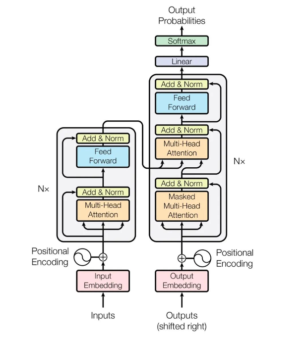

# 算法岗基础面试题目汇总

## 1.基础知识

### 1.1 什么是transformer，其结构中self-attention与attention区别是什么？

##### [transformer](https://www.bilibili.com/video/BV1J441137V6/?from=search&seid=3530913447603589730)是一种基于encoder-decoder的模型结构，其核心包含四个部分，Multi-Head Attention，Masked Multi-Head Attention，Feed Forward，Add and Norm。Self-attention中attention操作是query向量与key向量的内积操作，再对输出做一个softmax操作得到两个向量的注意力权重。 Multi-Head Attention，也即多头注意力，其在隐藏层的地方将单个维度变为多个维度，原先为BxLxH，现在将H维度变为hxhd维度,其中hd=H/h。这样做的好处是首先扩展了模型专注于不同位置的能力；另外多头还为注意力层提供了多个“表示子空间”，并且每一个Q、K、V都有多组值与之对应，这使得模型的泛化能力大大提升。Mask Multi-Head Attention 是通过mask操作将每一个序列元素之后的元素给掩盖掉，这样为了防止数据泄露导致模型出现过拟合的现象。

$$Attention(Q,K,V)=\frac{Q\cdot K^{T}}{\sqrt{d}}\cdot{V},Attention(Q,K,V)=\frac{Q\cdot K^{T}}{\sqrt{d/h}}\cdot{V}$$

##### 上式中除以d是为了防止维度过大导致在计算softmax之后计算结果比较小导致模型难以收敛。其结构如下图所示：

##### 

##### 其较于RNN的优点是可以并行化处理，较于CNN的优点是可以捕捉序列间的长期依赖关系，CNN需要更深更宽的结构才能捕捉到这种依赖关系，这会导致计算复杂度过大

### 1.2 常用的激活函数有哪些，他们的作用（适用场合分别是什么）？
##### 常用的激活函数有ReLU、GeLU、Sigmoid、Softmax、Swish等，表达式参看[激活函数](https://github.com/QinHsiu/Trick/tree/main/activate_function)。其中在CV领域中常常使用ReLU激活函数，在推荐领域中常常使用GeLU激活函数，这是因为CV领域中的图像是不需要进行Embedding处理直接放入模型中的，在推荐领域中往往需要对一些商品id、类别id先进行稀疏化embedding，然后再放入模型，这时直接使用ReLU激活函数会导致很多有用的信息会被丢失掉（为负值的神经元）。

### 1.3 交叉熵损失函数公式以及其含义？
##### 常用的损失函数参看[损失函数](https://github.com/QinHsiu/Trick/tree/main/loss_calculate)，最常用的是交叉熵损失函数，其表达式如下所示：
$$Cross-Entropy(pred,y)=-\sum{y\log(pred)}$$

### 1.4 优化器有哪些，他们的区别以及作用（适用场合分别是什么）？
##### 常用的优化器有SGD、Adam、AdamW等，SGD随机梯度下降，其任意陷入局部最小值，Adam和AdamW都可以动态调整学习率，这样可以帮助模型更好地训练

### 1.5 什么是欠拟合与过拟合，以及对应的解决办法有哪些？
##### 欠拟合是指模型没有充分学到数据中隐藏的特征表示，导致其在训练效果和测试效果上都很差，这种情况需要根据数据调整模型相关结构或者参数；
##### 过拟合是指模型在学习过程中被一些异常数据带偏了，简单来说就是本身数据中学到的表示为[0~1]，但是模型训练过程中偏向了2，导致其在训练效果上好，但是在测试集效果上差，这种情况可以先检查数据中是否存在异常值，然后再是修改模型结构或者参数

### 1.6 常用的标准化技术有哪些？
##### 常用的正则化技术有L范式、BatchNormal、LayerNormal等，给定一个三维数据[BxLxH]，BatchNormal是针对每一个Batch内的数据，其往往适用于L维度相差不大的数据，当每一个序列的数据长度相差较大时针对该batch内的序列进行标准化会导致数据中信息的流失

### 1.7 什么是梯度消失和爆炸，产生的原因和解决办法？
##### 梯度消失是指在训练过程中由于数

### 1.8 如何提高网络的泛化能力？

### 1.9 如何缓解正负样本不均衡的问题？

#### 1.10 XGboost，LightGBM，AdaBoost，GBDT的区别以及适用场景？

### 1.11 最小二乘法与极大似然估计的含义以及区别？

### 1.12 特征重要性判断常用技术有哪些？

### 1.13 如何判断一个模型的好坏？

### 1.14 简单描述什么是SVM？

### 1.15 简单介绍什么是Tensorflow的计算图？

### 1.16 在K-mens和Knn中为什么不使用曼哈顿距离计算相似度？

### 1.17 常见的特征工程处理技巧有哪些？

### 1.18 简要介绍一下逻辑回归与线性回归以及SVM的区别？

### 1.19 常用的归一化技术有哪些，以及为什么对数据需要做归一化？

### 1.20 什么是朴素贝叶斯，简单描述贝叶斯定理？

### 1.21 一个完整的机器学习项目流程？

### 1.22 简要介绍有监督学习、无监督学习、半监督学习的区别？

### 1.23 协方差与相关性有什么区别？

### 1.24 线性分类与非线性分类器的区别？

### 1.25 上采样方法总结？

### 1.26 验证集和测试集的作用？

### 1.27 交叉验证的理解和作用？

### 1.28 SGD与min-SGD的区别？

### 1.29 介绍一下优化器，以及他们的适用场景？

### 1.30 介绍一下自回归的模型？

## 2.进阶知识

### 2.1 LSTM结构推导，以及理解？

### 2.2 对epoch做shuffle类似于那种优化器？

## 3.其他资源

- [机器学习基础知识](https://github.com/chehongshu/machine-learning-interview-chinese)
- [经典机器学习基础面试题](https://mp.weixin.qq.com/s/ikk_5duD7UkLrNxVjnSHoQ)
- [机器学习面试200题](https://mp.weixin.qq.com/s/gfKAvmRKIDMrVNiIYhBN2A)
- [深度学习面试基础题](https://mp.weixin.qq.com/s/ceMHsPgtt1FI4nbIDiSWuw)
- [校招算法知识总结](https://mp.weixin.qq.com/s/lNvu_0PIKyXhKTN_R1lh3g)

